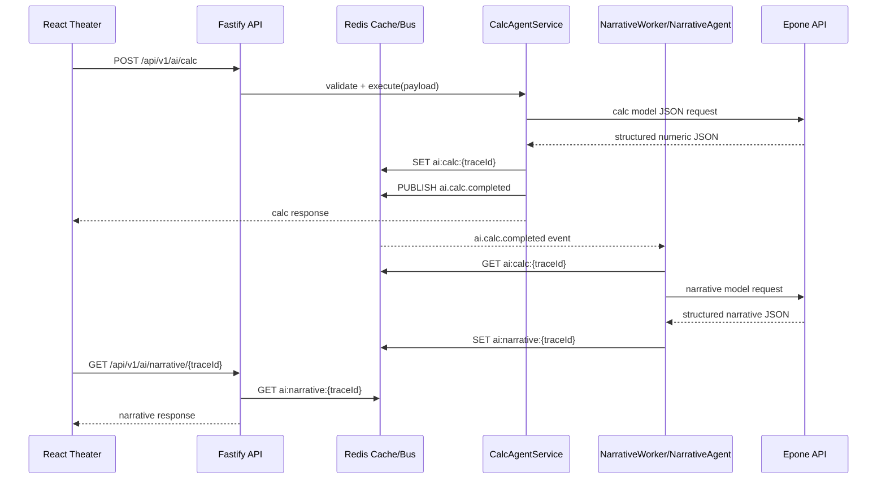

# 双 AI 接口架构文档

## 1. 架构说明
- `POST /api/v1/ai/calc` 负责高精度数值计算、结构化 JSON 输出、异常值检测与 Redis 提交。
- `GET /api/v1/ai/narrative/:traceId` 负责读取 Redis 已提交的计算结果，返回剧情文本。
- `NarrativeWorker` 订阅 `ai.calc.completed` 事件，在 calc 结果提交后异步生成剧情。
- 事务语义采用“读已提交”：只有 calc 结果写入缓存成功后才会发布事件，narrate 只读取已提交的缓存键。

## 2. 序列图

## 3. REST 契约
### 3.1 Calc 请求
- `traceId`: 幂等追踪 ID
- `action`: 本回合行动
- `player/emperor/location/time`: 计算上下文
- `weights`: 风险、收益、稳定性等权重

### 3.2 Calc 响应
- `probability`: 成功率，统一 4 位小数
- `deltas`: 资源与属性变化值
- `metrics`: 数值节点，供剧情引用
- `anomalyDetected`: 是否命中异常检测
- `rollbackSuggested`: 是否建议回滚到上一个已提交状态

### 3.3 Narrative 响应
- `summary`: 段落摘要
- `lines[]`: 带 `speaker`、`emotion` 的叙事行
- `referencedMetrics[]`: 至少 3 个数值节点
- `locale`: 语言标签

## 4. 错误码表
| 错误码 | 含义 | 是否可重试 |
| --- | --- | --- |
| `AI_4000` | 请求契约不合法 | 否 |
| `AI_5001` | 计算 AI 超时 | 是 |
| `AI_5002` | 计算 AI JSON 非法 | 是 |
| `AI_5003` | 命中异常值检测 | 否 |
| `AI_5004` | Redis 写入或发布失败 | 是 |
| `AI_6001` | 剧情结果尚未就绪 | 是 |
| `AI_6002` | 剧情生成重试失败 | 是 |
| `AI_9000` | 未分类内部错误 | 视情况 |

## 5. SLA 目标
- 数据计算 AI: 目标 `P95 <= 800ms`，可通过 `AI_TIMEOUT_MS=700` 为网络抖动预留余量。
- 剧情补全 AI: 目标 `>= 150 token/s`，依赖模型实际吞吐；服务端仅保留异步订阅与缓存链路。
- 并发: 目标 `50 QPS`，建议生产环境使用 Redis 单独部署与 Fastify 多实例。
- 可用性: 月可用性目标 `99.5%`，关键依赖为 Redis 与外部模型供应商。

## 6. 回滚方案
- 数值异常: `CalcAgentService` 在异常值检测命中后切换到本地公式回退，并标记 `rollbackSuggested=true`。
- 发布失败: 若 Redis 发布失败，calc 请求返回错误，前端不得提交状态变更。
- 剧情失败: Narrative Worker 重试 3 次，仍失败则报警并允许后续人工/自动补偿重新生成。
- 存档一致性: 前端仅在 calc 成功返回后写入 Zustand；narrative 属于展示层补全，不反向污染已提交数值。

## 7. 测试与压测
- 单元测试: `server/tests/unit/calcService.test.ts`
- 集成测试: `server/tests/integration/aiRoutes.test.ts`
- 压测脚本: `scripts/perf/ai-contract.perf.cjs`
- 覆盖建议: 增加对 Redis 真连接、Epone 超时、异常值回退和多语言剧情输出的测试样例。
