# 后宫养成游戏系统拆解文档

> 产出身份：游戏系统策划  
> 分析对象：`D:\02-project-codex-ai-config-wiring-fix`  
> 主要依据：`game word` 规则文档、`reports/game-architecture.txt`、`docs/*architecture.md`、`src/game`、`src/config`、`server/src`

## 1. 项目定位

本项目是一个“宫斗 / 剧情 / 数值养成”游戏原型。当前实现形态是横屏古风视觉小说舞台，核心玩法由时间推进、行动选择、属性成长、后宫关系、宫斗案件、侍寝怀孕、位分治理和 AI 对话包装共同驱动。

| 维度 | 当前结论 |
|---|---|
| 游戏类型 | 宫斗剧情养成，带多路线、多结局、数值经营 |
| 操作单位 | 每旬 7 个时间格，每月 3 旬，每年 12 月 |
| 核心体验 | 选择路线入宫 -> 分配属性 -> 行动经营 -> 关系/声望/宠爱变化 -> 月结算推进身份与风险 |
| 技术架构 | React + Vite 前端，Zustand 本地状态，Fastify 后端，Zod 契约校验 |
| AI 定位 | AI 负责文本、对话、倾向判断；硬数值、合法性、存档真值由系统规则控制 |
| 当前完成度 | 启动、路线、属性、开场引导、地图、寝殿主循环、妃嫔/情缘/物品/宫务面板雏形、部分 AI 接口和 Foundation 规则服务 |

## 2. 总体系统架构

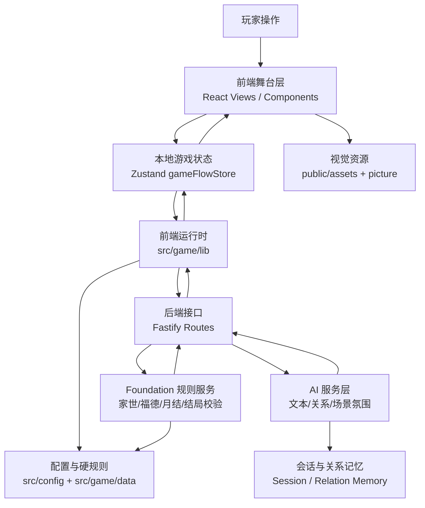

### 2.1 代码分层

| 层级 | 目录 / 文件 | 主要职责 |
|---|---|---|
| 应用入口 | `src/App.tsx` | 根据 `currentView` 切换启动、路线、属性、开场、地图、寝殿 |
| 页面视图 | `src/views/*` | 承载关键流程页面和主玩法界面 |
| UI 组件 | `src/components/*` | 对话框、状态栏、妃嫔列表、寝殿子面板等 |
| 游戏状态 | `src/game/store/gameFlowStore.ts` | 当前存档真值、时间、资源、妃嫔、物品、关系进度、结算报告 |
| 游戏类型 | `src/game/types.ts` | 路线、时间、属性、道具、妃嫔、关系 AI、存档结构类型 |
| 规则配置 | `src/config/*` | 时间、体力、位分、路线、地点开放、颜色、系统事件等硬规则 |
| 前端运行时 | `src/game/lib/*Runtime.ts` | 本地兜底对话、地点交互、关系判定调用、寝殿工具函数、玩家姓名称呼解析 |
| 后端入口 | `server/src/app.ts` | 装配 AI、Foundation、Memory、路由、缓存、错误处理 |
| AI 路由 | `server/src/routes/aiRoutes.ts` | `/api/v1/ai/*` 对话、数值、关系、场景氛围接口 |
| Foundation 路由 | `server/src/routes/foundationRoutes.ts` | `/api/v1/foundation/*` 家世、福德、月结、晋升、结局校验 |
| 规则文档 | `game word/`、`docs/`、`reports/` | 系统硬规则、AI 接口、剧情节点、经济、宫斗、怀孕等策划源文档 |

## 3. 玩家主流程

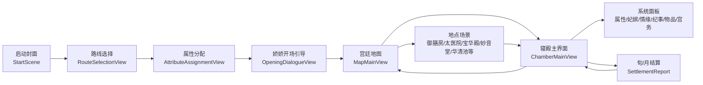

### 3.1 当前页面流与状态字段

| 流程节点 | 视图 | 关键状态 |
|---|---|---|
| 启动 | `StartScene` | `currentView='start'` |
| 选线 | `RouteSelectionView` | `selectedRoute`、`routeId`、路线基础数值 |
| 属性 | `AttributeAssignmentView` | `state.name`、`age`、`family`、`stats`、`pointsLeft` |
| 开场 | `OpeningDialogueView` | `openingTendency`、`openingGuideFinished`、开场 AI/本地兜底 |
| 地图 | `MapMainView` | `activeMapLocation`、`mapEventText`、地点热点、宫门 NPC |
| 寝殿 | `ChamberMainView` | `activeChamberPanel`、训练行动、地点子场景、结算报告 |
| 面板 | `components/chamber/*` | 妃嫔、情缘、纪事、库存、宫务、杂项信息 |

启动菜单现状：

- `开始` 已接入新局流程：先弹二级确认，确认后清空旧存档，重建初始状态，进入路线选择。
- `回溯` 已接入单槽读档：读取上一次 `SaveGameV1`，并根据存档进度恢复到路线选择、属性页、地图或寝殿。
- `前尘` 目前只存在于 `StartScene` 的按钮文案中，尚未接入成就 / 结局 / 前世记录系统。
- `设置` 目前只存在于按钮文案中，尚未接入设置页。
- 存档维护规则以 `docs/save-system-maintenance.md` 为准；不得再用单纯 `setCurrentView('route-selection')` 代替新局创建。

姓名显示规范：

- `state.name` 是玩家当前姓名真值。
- 属性页修改姓名必须通过 `gameFlowStore.setPlayerName(name)`，同步 `state.name` 与 `selectedRoute.defaultName/baseState.name`。
- 剧情文本需要称呼玩家时，优先使用 `src/game/lib/playerNameRuntime.ts` 生成完整姓名、姓氏或 `某氏`，避免继续写死路线默认名。
- 路线历史背景中的家族案名可以保留固定设定；他人对玩家的直接称呼必须读取当前姓名。

属性加点交互规范：

- 属性加减按钮的 `disabled` 必须反映当前硬规则，而不是只在点击回调里阻止非法操作。
- 当前值等于字段下限时禁用 `减少`；当前值等于字段上限时禁用 `增加`。
- `pointsLeft` 为 0 时禁用所有需要消耗点数的 `增加` 操作，但仍允许对高于下限的属性执行 `减少` 以回收点数。
- 路线锁定属性时，属性加减按钮全部禁用。

剧情 / 对话交互锁规范：

- `GlobalDialogueStage` 是剧情、旁白、地图提示、寝殿反馈和通报的共享遮罩入口。
- 任意剧情 / 对话文本正在显示时，除当前对话框、分支选项和同场景明确允许的操作区外，背景 UI 不能响应点击。
- 视觉层由 `global-dialogue-stage__interaction-lock` 吃掉背景鼠标事件；业务层由 `ChamberMainView`、`MapMainView` 的交互锁判断兜底，避免键盘、测试或程序化点击绕过遮罩。
- 寝殿行动反馈未收起时，不能继续点学习、外出、家族事务、情缘等按钮；地图剧情反馈未收起时，不能点侧栏或热点。
- 后续新增剧情浮层时，如果复用 `GlobalDialogueStage`，默认继承交互锁；如果自建浮层，必须显式说明哪些背景操作仍可点。

## 4. 核心玩法循环

### 4.1 单旬循环

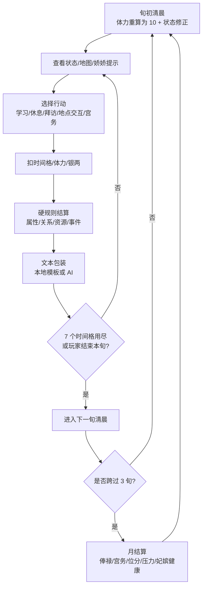

### 4.2 月循环

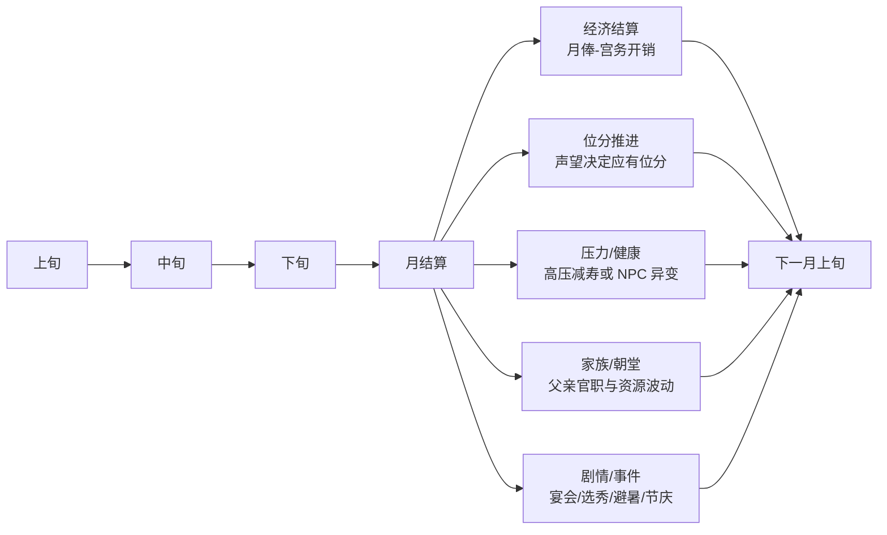

## 5. 系统思维导图

```mermaid
flowchart TB
  Root["后宫养成系统"]

  Root --> Time["时间经营"]
  Time --> TimeA["年月旬"]
  Time --> TimeB["七时间格"]
  Time --> TimeC["旬初体力重算"]
  Time --> TimeD["月结算"]

  Root --> Growth["玩家成长"]
  Growth --> MainStats["主属性"]
  MainStats --> Health["健康"]
  MainStats --> Fortune["福德"]
  MainStats --> Intrigue["心计"]
  MainStats --> Appearance["容貌"]
  MainStats --> Temperament["气质"]
  Growth --> Skills["副属性"]
  Skills --> Poetry["诗词"]
  Skills --> Music["乐理"]
  Skills --> Painting["丹青"]
  Skills --> Embroidery["刺绣"]
  Skills --> Medicine["药理"]
  Skills --> Politics["政治"]
  Growth --> Resources["资源"]
  Resources --> Silver["银两"]
  Resources --> Prestige["声望"]
  Resources --> Favor["宠爱"]
  Resources --> Stress["压力"]
  Resources --> TrueHeart["真心值"]

  Root --> Harem["后宫生态"]
  Harem --> Consorts["妃嫔名单"]
  Harem --> FavorTier["宠爱档位"]
  Harem --> Relation["关系与倾情"]
  Harem --> Rank["位分与居所"]
  Harem --> ColdPalace["冷宫"]

  Root --> Events["事件系统"]
  Events --> Banquet["宫宴"]
  Events --> FamilyBanquet["家宴"]
  Events --> Selection["选秀"]
  Events --> Summer["避暑"]
  Events --> Strife["宫斗案件"]
  Events --> Pregnancy["侍寝怀孕"]

  Root --> External["外部经营"]
  External --> Family["家族事务"]
  External --> Court["朝堂事务"]
  External --> Heir["皇嗣管理"]
  External --> Trade["杜娘交易"]

  Root --> AILayer["AI 包装"]
  AILayer --> OpeningAI["开场引导"]
  AILayer --> DialogueAI["妃嫔对话"]
  AILayer --> JudgeAI["关系倾向判定"]
  AILayer --> AmbientAI["地点氛围文本"]
  AILayer --> Fallback["本地兜底"]
```

## 6. 数值状态模型

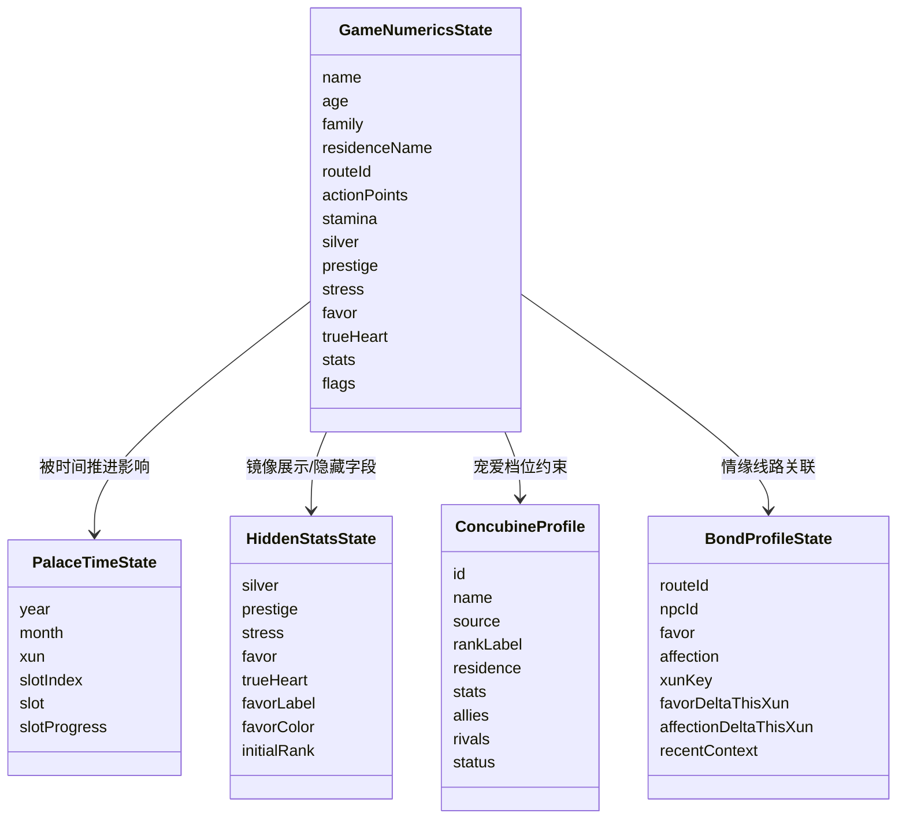

### 6.1 核心数值表

| 类别 | 字段 | 范围 / 口径 | 主要来源 | 主要用途 |
|---|---|---|---|---|
| 时间 | `year/month/xun/slot` | 12 月、3 旬、7 格 | `advanceTime` | 行动消耗、事件触发、结算 |
| 体力 | `stamina` | 0..15，旬初基础 10 | 寝殿行动、休息、饮食、温泉 | 控制行动频率 |
| 银两 | `silver` | 非负 | 月俸、赠银、交易 | 购买、案件干预、朝堂/家族投入 |
| 声望 | `prestige` | -2000..5000 | 宴会、侍寝、家族、宫斗结果 | 位分、结局、冷宫风险 |
| 宠爱 | `favor` | -100..100 | 皇帝互动、妃嫔美言/抹黑 | 侍寝权重、月俸修正、宠爱档位 |
| 真心 | `trueHeart` | 路线差异 | 特殊剧情、长期互动 | 夜晚权重、宽判、真爱保护 |
| 压力 | `stress` | 0..100 | 宫斗、杀人、造谣陷害 | 减寿、性情变化、疯癫风险 |
| 福德 | `fortune` | -100..100 | 礼佛、造谣、下毒 | 怀孕、流产、道德风险 |
| 主属性 | 健康/心计/容貌/气质 | 0..1000 | 开局分配、行动、物品 | 生产、宫斗、表现、魅力 |
| 副属性 | 诗词/乐理/丹青/刺绣/药理/政治 | 0..100 | 学习、地点交互 | 才艺、医药、朝堂、剧情门槛 |

### 6.2 数值变化反馈

玩家核心数值变化必须同时满足“硬规则先结算”和“界面即时可见”：

- 数值真值仍由 `gameFlowStore` 的 `state` / `hiddenStats` 与各 runtime 规则结算，不由文案决定
- 声望扣减允许进入负值，玩家与妃嫔侧统一按 `PRESTIGE_RANGE = [-2000, 5000]` 裁剪，不再以 0 为下限
- toast 只负责展示差值，不反向参与规则计算
- toast 观察银两、声望、压力、真心、属性字段与妃嫔声望 / 压力；体力和宠爱变化由常驻状态栏、面板或叙事通报承接，不触发 toast
- 属性字段按当前玩家界面口径换算展示：主属性通常乘 100，副属性通常乘 10，避免出现内部小数
- 单次状态变化中的每个差值必须独立生成 toast，连续变化可叠加多个 toast
- toast 不随数值写入立即显示；数值变化先按事件桶排队，等对应行动对白、地图反馈、夜晚通报或旬月通报实际出现后再释放
- 侍寝、宫斗、月结等来源造成的声望变化必须进入 toast；宠爱变化不进入 toast
- 转场、地图切换、寝殿对白切换不得卸载或吞掉尚未读完的数值反馈
- 寝殿行动与侍寝通报文本不展示具体属性 / 宠爱 / 真心 / 声望加减，只保留叙事反馈；允许展示的具体数值变化由 toast 展示，宠爱和体力除外
- 角色选择、属性分配、开场剧情等初始化阶段只刷新数值基线，不显示 toast；进入地图或寝殿后才开始显示数值变化

## 7. 路线系统

| 路线 | 初始倾向 | 设计功能 |
|---|---|---|
| 兰因絮果 | 高起点宫廷权力线 | 主要承载权力、皇嗣、摄政、独宠、共主等结局 |
| 浮生如梦 | 标准剧情线 | 承载非意外结局与情感叙事 |
| 影落掖庭 | 低资源翻案线 | 以沉冤得雪、证据、家族翻案为主目标 |
| 尘缘夙错 | 异国/故国线 | 承载和亲、改朝换代、阿翎等专属内容 |

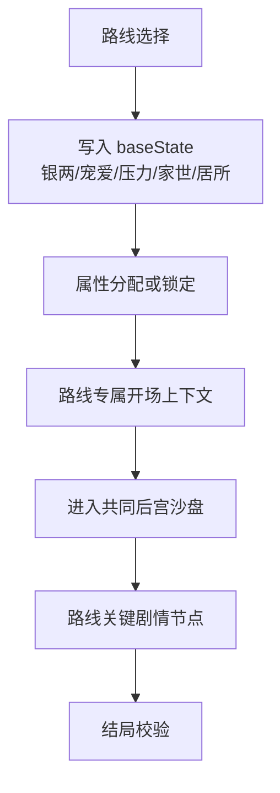

系统宫宴当前已接入第一版纵向闭环：

- 报名开启：跨入目标宫宴前三个月的报名起点时，生成 `event` 类通报，由司乐女官 / 掌册宫人提醒妙音堂开始收录曲谱。
- 报名：玩家在妙音堂提交一张曲谱，系统保存曲谱快照到 `palaceBanquetProgress.submittedScore`，本届不重复改写。
- 结算：每年 3 月上旬傍晚进入系统宫宴，宫宴占用傍晚和夜晚，结算后停在深夜。
- 结果：`palaceBanquetRuntime` 根据曲谱品质、才艺、听曲次数和连翘关系计算完成度，并结算声望变化与事件通报。
- 去重：`lastRegistrationNoticeSeasonKey` 与 `lastResolvedSeasonKey` 防止报名提醒和宫宴结算因读档或连续推进重复触发。

曲谱第一阶段只服务系统宫宴；后续若扩展排练、熟练度、适性或妃嫔竞争，应继续以宫宴 runtime 作为唯一硬结算入口。

路线选择也是新建一局的边界：调用 `applyRouteSelection` 时必须从初始状态重建路线状态，重置时间、临时文本、结算通报、宫斗案件、侍寝进度、交易记录、库存与关系进度，避免旧存档状态串入新局。

启动页“开始”才是清档新建存档的入口；路线选择只负责写入具体路线档案，不负责二级确认。

## 8. 地图与场景系统

### 8.1 场景结构

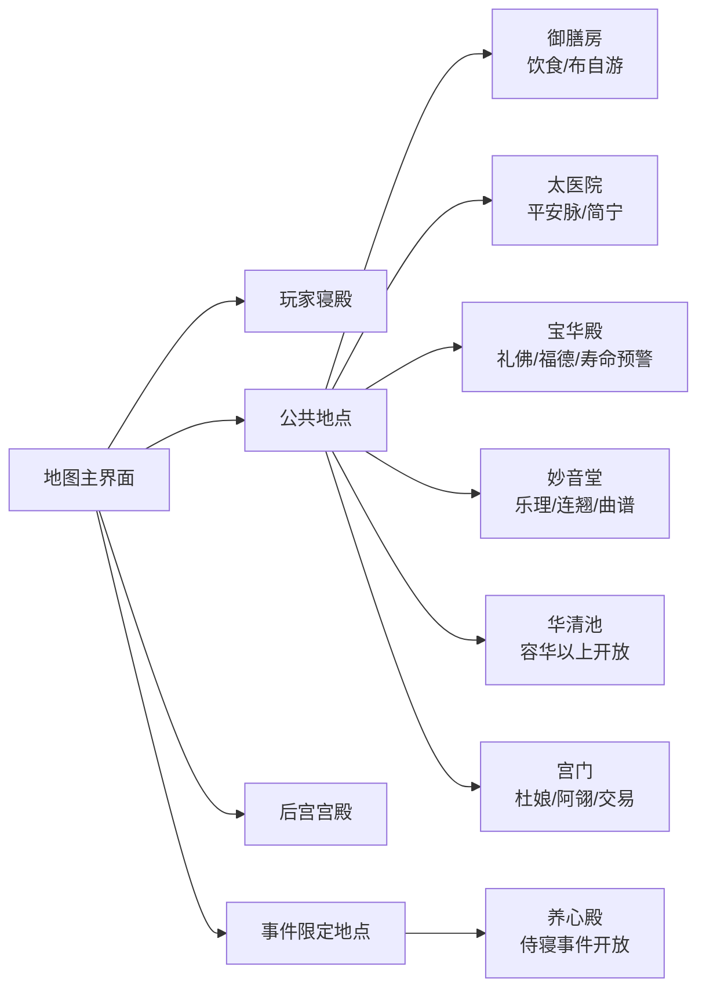

### 8.2 地点开放规则

| 地点类型 | 示例 | 开放口径 |
|---|---|---|
| 全天开放 | 御书房、御膳房、太医院、妙音堂、宝华殿、御花园、后宫宫殿 | 任意时间格可进入 |
| 时段开放 | 正阳门、宫门、重华宫 | 指定时间段开放 |
| 事件开放 | 养心殿 | 仅侍寝等事件触发时开放 |
| 条件开放 | 华清池 | 位分达到容华及以上 |

## 9. 寝殿行动系统

| 行动 | 时间 | 体力 | 叙事反馈 |
|---|---:|---:|---|
| 诵读经典 | 1 格 | 消耗 | 静心温书 |
| 泼墨作画 | 1 格 | 消耗 | 铺纸试墨 |
| 镂月裁云 | 1 格 | 消耗 | 理线补绣 |
| 调制香薰 | 1 格 | 消耗 | 辨香调方 |
| 习舞奏乐 | 1 格 | 消耗较多 | 校音习舞 |
| 请平安脉 | 1 格 | 不消耗 | 请医问诊 |
| 殿内小酣 | 1 格 | 恢复 | 闭目养神 |
| 外出探索 | 0 格 | 0 | 切至地图 |
| 结束本旬 | 跳转 | 0 | 进入下一旬清晨，体力重算 |

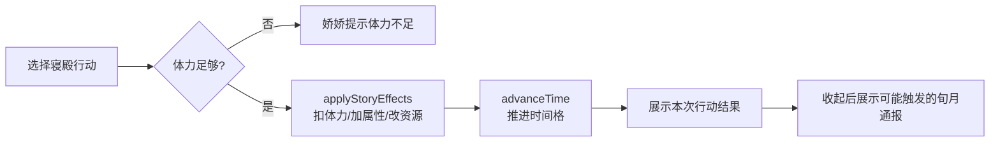

寝殿反馈顺序：

- 普通行动：先结算数值并显示行动结果对白，再进入后续通报或夜晚事件
- 跨旬行动：若行动推进到下一旬，仍先展示本次行动结果，玩家收起后再显示新旬通报
- 外出探索：先显示出行提示，玩家确认后再切到地图，避免提示被转场立即盖掉
- 结束本旬：仍保留原有夜晚/侍寝/清晨通报链路

## 10. 后宫关系系统

### 10.1 关系对象分类

| 对象类型 | 示例 | 系统作用 |
|---|---|---|
| 皇帝 | 容安 | 宠爱、真心、侍寝、册封、养心殿裁断、结局 |
| 固定剧情妃 | 姚玲儿、柳仪芳、江晚晚、沈妙清、陈婉宁等 | 竞争、结盟、剧情节点、案件目标 |
| 可攻略 NPC | 当一、简宁、卢安平、布自游、连翘、阿翎 | 情缘线、地点互动、特殊资源 |
| 工具 NPC | 娇娇、杜娘等 | 引导、通报、交易、系统入口 |
| 自定义剧情妃 | 玩家提交生成 | 丰富后宫生态，必须经硬规则校验 |

### 10.2 关系变动规则

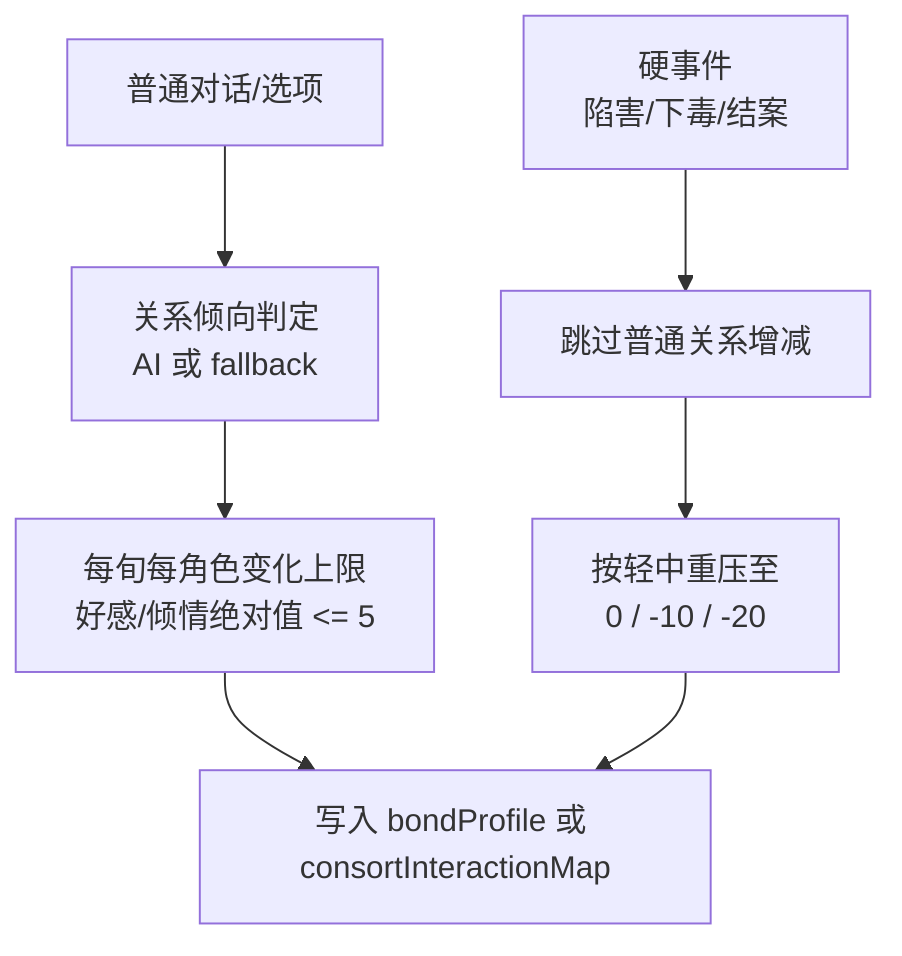

### 10.3 宠爱档位

| 档位 | 范围 | 系统意义 |
|---|---:|---|
| 憎恶 | -100 ~ -50 | 负面关系，高风险 |
| 厌恶 | -49 ~ 0 | 无宠或厌弃 |
| 无宠 | 1 ~ 20 | 低存在感 |
| 小宠 | 21 ~ 40 | 轻度宠爱 |
| 得宠 | 41 ~ 60 | 可参与较多竞争，最多 4 人 |
| 盛宠 | 61 ~ 80 | 高权重，最多 2 人 |
| 独宠 | 81 ~ 100 | 最高档，最多 1 人 |

## 11. 宫斗与案件系统

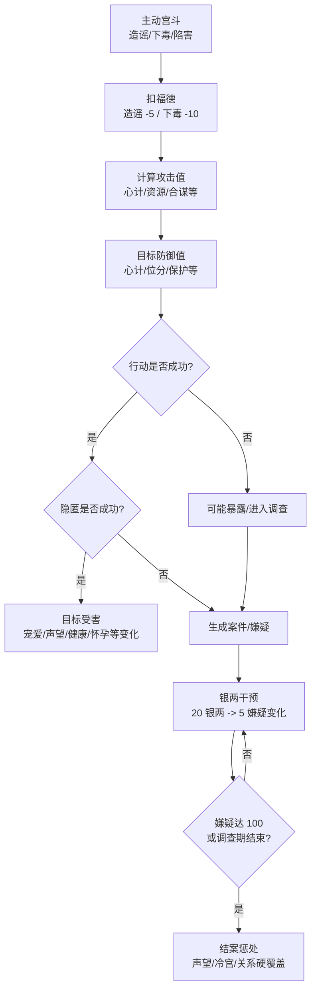

| 子系统 | 关键规则 |
|---|---|
| 主动宫斗 | 造谣、下毒等会消耗福德并增加压力 |
| 两次检定 | 先判行动是否成功，再判是否被发现 |
| 合谋/嫁祸 | 可引入第三方，提高复杂度和案件对象 |
| 案件干预 | 个人事务和旁观案件均按 20 银两换 5 点嫌疑变化 |
| 结案影响 | 若确认陷害/下毒，关系走硬覆盖，不走普通好感增减 |
| 冷宫联动 | 事件导致声望小于 0 可立即进入冷宫 |

## 12. 侍寝、怀孕与皇嗣系统

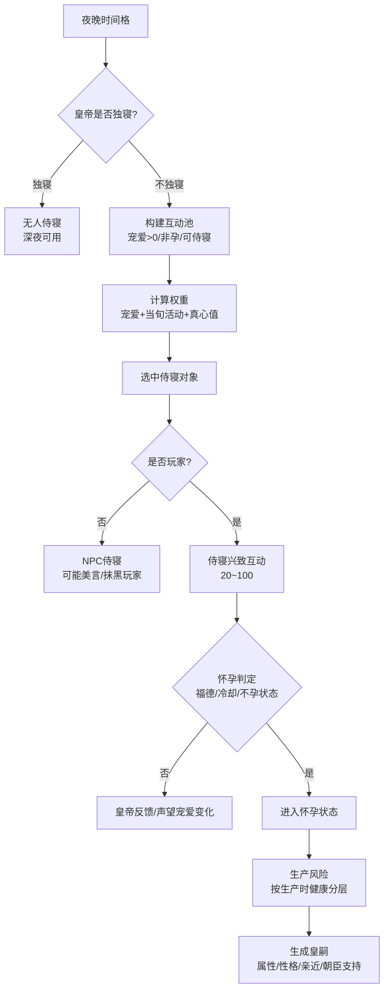

### 12.1 关键规则拆解

| 模块 | 规则要点 |
|---|---|
| 夜晚选中 | 不是每个妃子独立百分比，而是互动池权重抽取 |
| 皇帝心情 | 影响独寝、册封、养心殿裁断 |
| 真心值 | 影响夜晚权重、御书房带回、求情宽判、处罚保底 |
| 侍寝兴致 | 初始兴致与宠爱档位/历史表现有关，满 100 可额外声望 |
| 怀孕前提 | 生产/流产后 3 个月生育冷却期内不能怀孕 |
| 怀孕概率 | 与福德等硬规则相关，永久不孕为独立隐藏状态 |
| 生产风险 | 按生产时健康值分层结算 |
| 皇嗣管理 | 出生后进入养育、教育、立储、朝臣支持系统 |

## 13. 位分、冷宫与协理六宫

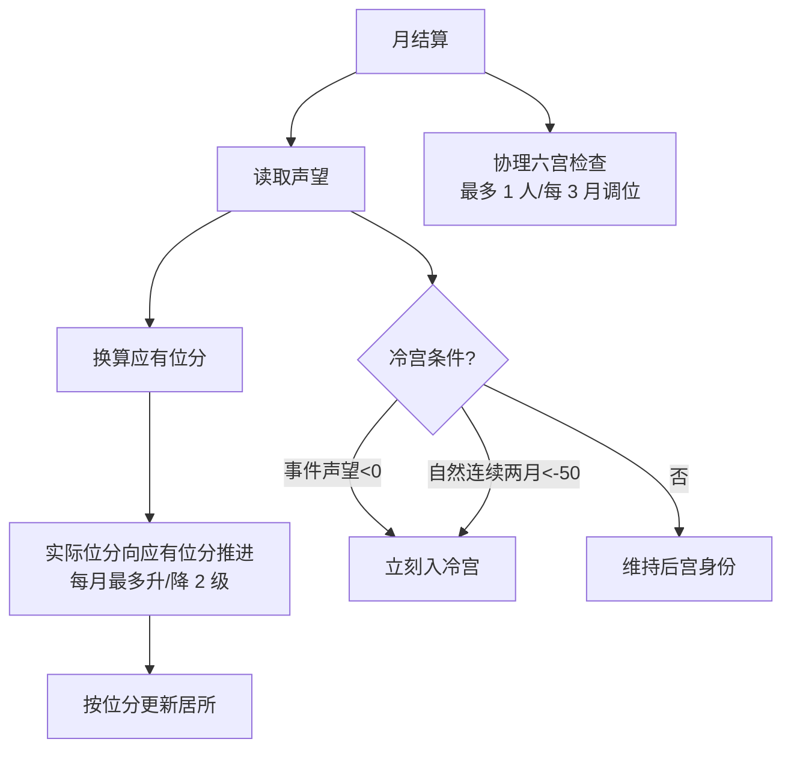

| 机制 | 设计意义 |
|---|---|
| 声望定应有位分 | 避免“未侍寝不能晋升”的旧限制，所有经营都能转化身份 |
| 每月最多 2 级 | 控制身份变动节奏，避免数值爆发 |
| 皇贵妃条件 | 无皇后、皇后健康/宠爱长期失衡等打开特殊高位 |
| 冷宫双路径 | 事件惩处即时冷宫，自然低声望连续触发冷宫 |
| 真爱保护 | 当前皇帝真心值最高者受罚后声望保底 |
| 协理六宫 | 高位权力玩法，可对低位妃嫔调位并由娇娇通报 |

## 14. 经济与物品系统

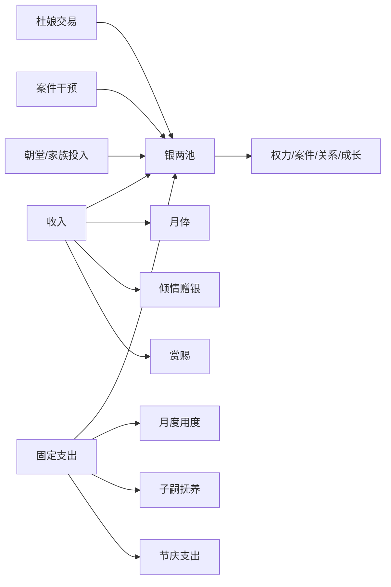

| 系统 | 规则摘要 |
|---|---|
| 月俸 | 按位分基础值，低宠可克扣，高宠可补贴 |
| 月度用度 | 节衣缩食/量入为出/锦衣玉食三档，按实际月俸 25%/50%/75% 结算，并影响声望与健康 |
| 物品品质 | 绿色、蓝色、紫色、红色四档 |
| 补品 | 可送礼或自用，提供健康与容貌 |
| 稀有丹药 | 杜娘池：冷香丸、驻颜丹、延寿丹、缠梦香等 |
| 赏赐池 | 皇帝/太后赏赐池与杜娘稀有池隔离 |
| 大额事件 | 后期 2000/4000/6000 档朝堂事件，提高夺位成功率 |

## 15. AI 与硬规则边界

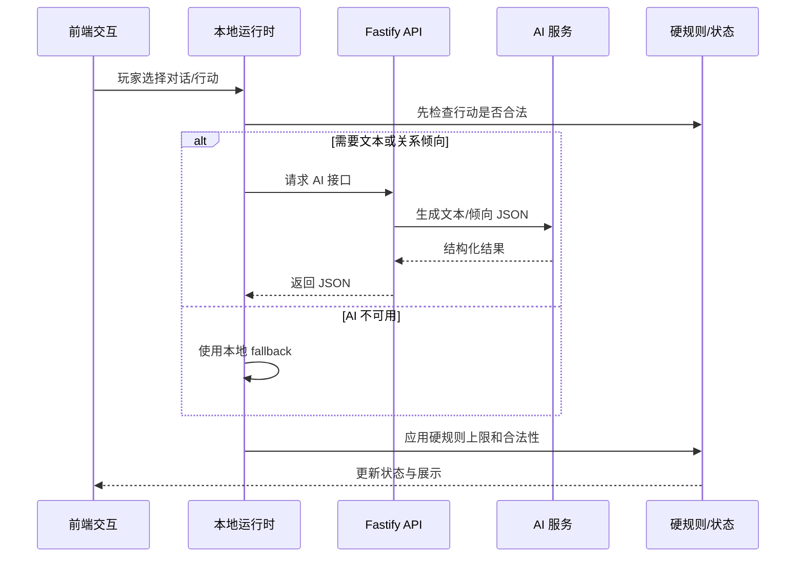

### 15.1 AI 接口分工

| 接口 | 路径 | 职责 | 硬边界 |
|---|---|---|---|
| 健康检查 | `/api/v1/ai/health` | API 可用性 | 不影响玩法 |
| 数值 AI | `/api/v1/ai/calc` | 结构化数值建议 | 需系统校验，不直接写真值 |
| 开场对话 | `/api/v1/ai/opening-dialogue` | 娇娇引导文本与选项包装 | 本地模板可完整兜底 |
| 妃嫔对话 | `/api/v1/ai/consort-dialogue` | 妃嫔对话文本、候选记忆 | 不突破关系变化上限 |
| 关系判定 | `/api/v1/ai/relationship-judge` | 将选项判为 friendly/flirt/cold 等 | 每旬每角色好感/倾情变化绝对值 <= 5 |
| 地点氛围 | `/api/v1/ai/taiyi-ambient`、`temple-ambient`、`miaoyin-ambient` | 场景文案 | 不决定真实收益 |
| 剧情结果 | `/api/v1/ai/narrative/:traceId` | 异步剧情包装 | 结果未就绪返回可重试错误 |

### 15.2 设计原则

| 原则 | 说明 |
|---|---|
| 硬规则先算 | 能不能做、成功率、数值变化、是否建案、晋升、怀孕都由系统决定 |
| AI 后包装 | AI 只负责对白、描述、选项语气、阶段文风、总结 |
| JSON 驱动 | AI 返回结构化 JSON，前端不拼接自由文本作为真值 |
| 可关闭 AI | 关闭 AI 后仍能用模板文本、固定选项、本地关系标签跑完整流程 |
| 关系上限 | 普通对话每旬每角色变化受硬上限约束 |

## 16. Foundation 规则服务

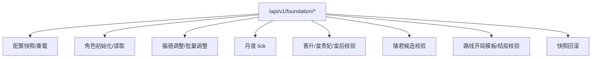

| 能力 | 作用 |
|---|---|
| 配置快照 | 给 GM 或调试工具查看当前规则配置 |
| 角色初始化 | 根据路线、家世生成基础状态 |
| 福德调整 | 支持单人或批量操作，便于宫斗/礼佛接入 |
| 月度 tick | 处理路线压力、寿命、月结类规则 |
| 晋升校验 | 判断皇贵妃、皇后、声望推进等硬条件 |
| 储君校验 | 处理血脉、路线限制、候选资格 |
| 结局校验 | 兰因絮果等路线结局条件表 |
| 回滚 | 为 GM 和异常规则测试提供恢复能力 |

## 17. 系统依赖矩阵

| 系统 | 依赖 | 产出 | 影响 |
|---|---|---|---|
| 时间系统 | 玩家行动、事件强制跳转 | 当前时辰、旬/月结算 | 所有周期性系统 |
| 体力系统 | 时间、状态修正、物品 | 行动可执行性 | 学习、拜访、探索节奏 |
| 属性成长 | 行动、物品、剧情 | 主/副属性变化 | 宫斗、侍寝、生产、剧情门槛 |
| 宠爱/真心 | 皇帝互动、妃嫔行为、剧情 | 宠爱档位、夜晚权重 | 侍寝、月俸、宽判、结局 |
| 声望/位分 | 宴会、侍寝、家族、案件 | 位分、居所、冷宫风险 | 地图权限、身份权力、结局 |
| 宫斗案件 | 心计、福德、银两、关系 | 嫌疑、案件、惩处 | 关系、声望、冷宫、压力 |
| 怀孕皇嗣 | 侍寝、福德、健康、冷却 | 孕期、子嗣、立储候选 | 权力线、经济压力、结局 |
| 经济 | 月俸、宫务、交易、案件 | 银两增减、物品 | 干预案件、朝堂投入、成长 |
| AI 对话 | 状态上下文、记忆、接口 | 文本、语气标签、候选记忆 | 沉浸感、关系体验 |

## 18. 当前落地状态评估

| 模块 | 状态 | 说明 |
|---|---|---|
| 启动/路线/属性 | 已落地 | 主流程可进入地图与寝殿 |
| 时间/体力 | 部分落地 | `advanceTime` 支持时间格、旬/月推进、旬初体力重算 |
| 寝殿行动 | 已落地基础版 | 学习、休息、外出、结束本旬已接入 |
| 地图系统 | 部分落地 | 热点、宫门 NPC、部分地点子场景已接入 |
| 妃嫔系统 | 部分落地 | 初始名单、规范化、宠爱档位上限、面板展示 |
| 情缘系统 | 部分落地 | bondProfile、关系判定、每旬增减上限 |
| 物品/杜娘 | 部分落地 | 购买、出售、库存、回收价、稀有池雏形 |
| 系统宫宴 | 部分落地 | 报名提醒、妙音堂曲谱提交、3 月上旬自动结算和宫宴结果存档已接入；玩家自主宴席仍是占位 |
| 宫斗案件 | 规则充分，玩法待完整接入 | 文档完整，面板和数据结构仍需扩展 |
| 侍寝怀孕 | 规则充分，玩法待完整接入 | 侍寝、怀孕、生产、皇嗣文档详尽，代码侧仍在接口/规则准备阶段 |
| 位分冷宫 | 部分落地 | 月结位分推进和居所更新已在 store 中出现，完整冷宫规则仍需接入主循环 |
| AI 系统 | 已有接口骨架 | 开场、妃嫔对话、关系判定、地点氛围均有服务和 fallback 思路 |
| Foundation | 已有后端服务 | 更像规则沙盒/GM 接口，尚未完全并入前端主循环 |

## 19. 策划视角的主风险

| 风险 | 表现 | 建议 |
|---|---|---|
| 状态模型双轨 | `docs/game-state-model.md` 的 SaveGameV1 比当前 `gameFlowStore` 更完整 | 后续应明确当前 store 是原型存档，还是逐步迁移到 SaveGameV1 |
| 规则已很大，玩法入口未全接 | 宫斗、怀孕、皇嗣、朝堂规则充足，但前端多为预留入口 | 先做纵向闭环，不要继续横向扩写规则 |
| AI 与硬规则边界易漂移 | AI 服务多，若直接返回结果可能影响真值 | 所有 AI 响应必须经过本地/后端 schema 与规则钳制 |
| 月度压力尚未完整释放 | 前 1~3 月可能偏顺，文档也标注待平衡 | 先接入宫务、宴会、家族、案件最小压力，再调数值 |
| 中文字段与技术字段混用 | 配置中存在中文枚举和英文状态键并行 | 保留展示中文，存档真值建议统一英文 key |

## 20. 推荐后续开发顺序

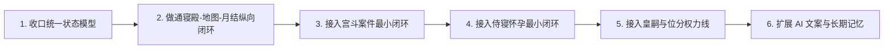

| 优先级 | 任务 | 目标 |
|---|---|---|
| P0 | 统一主存档结构 | 避免后续玩法接入时状态迁移成本失控 |
| P0 | 完成月结算压力闭环 | 让体力、银两、声望、位分真正形成经营压力 |
| P1 | 宫斗案件 MVP | 做通“发起 -> 检定 -> 嫌疑 -> 干预 -> 结案” |
| P1 | 侍寝怀孕 MVP | 做通“夜晚池 -> 侍寝 -> 兴致 -> 怀孕/未孕” |
| P2 | 皇嗣早期养成 | 先接出生后 0~3 岁经济和亲近，再做教育/立储 |
| P2 | AI 记忆正式化 | 将候选记忆晋升为长期关系记忆，但不改硬数值 |

## 21. 一句话系统总结

这是一个以“旬行动 + 月结算”为骨架，以“声望/宠爱/福德/压力/银两”为核心资源，以“后宫关系、宫斗案件、侍寝怀孕、位分权力”为长期驱动的宫廷生存养成游戏；AI 应作为叙事和语气层增强沉浸感，不能替代硬规则成为数值裁判。
