# 后宫养成游戏系统拆解文档

> 产出身份：游戏系统策划  
> 分析对象：`D:\02-project-codex-ai-config-wiring-fix`  
> 主要依据：`game word` 规则文档、`reports/game-architecture.txt`、`docs/*architecture.md`、`src/game`、`src/config`、`server/src`

## 1. 项目定位

本项目是一个“宫斗 / 剧情 / 数值养成”游戏原型。当前实现形态是横屏古风视觉小说舞台，核心玩法由时间推进、行动选择、属性成长、后宫关系、宫斗案件、侍寝怀孕、位分治理和 AI 对话包装共同驱动。

| 维度 | 当前结论 |
|---|---|
| 游戏类型 | 宫斗剧情养成，带多路线、多结局、数值经营 |
| 操作单位 | 每旬 7 个时间格，每月 3 旬，每年 12 月 |
| 核心体验 | 选择路线入宫 -> 分配属性 -> 行动经营 -> 关系/声望/宠爱变化 -> 月结算推进身份与风险 |
| 技术架构 | React + Vite 前端，Zustand 本地状态，Fastify 后端，Zod 契约校验 |
| AI 定位 | 当前玩法不接入 AI 生成剧情正文；本地 CSV 是剧情正文和基础演出元数据唯一来源，关系倾向由本地标签先行判定；硬数值、合法性、存档真值由系统规则控制 |
| 当前完成度 | 启动、路线、属性、开场引导、地图、寝殿主循环、妃嫔/情缘/物品/宫务面板雏形、部分 AI 接口和 Foundation 规则服务 |

## 2. 总体系统架构

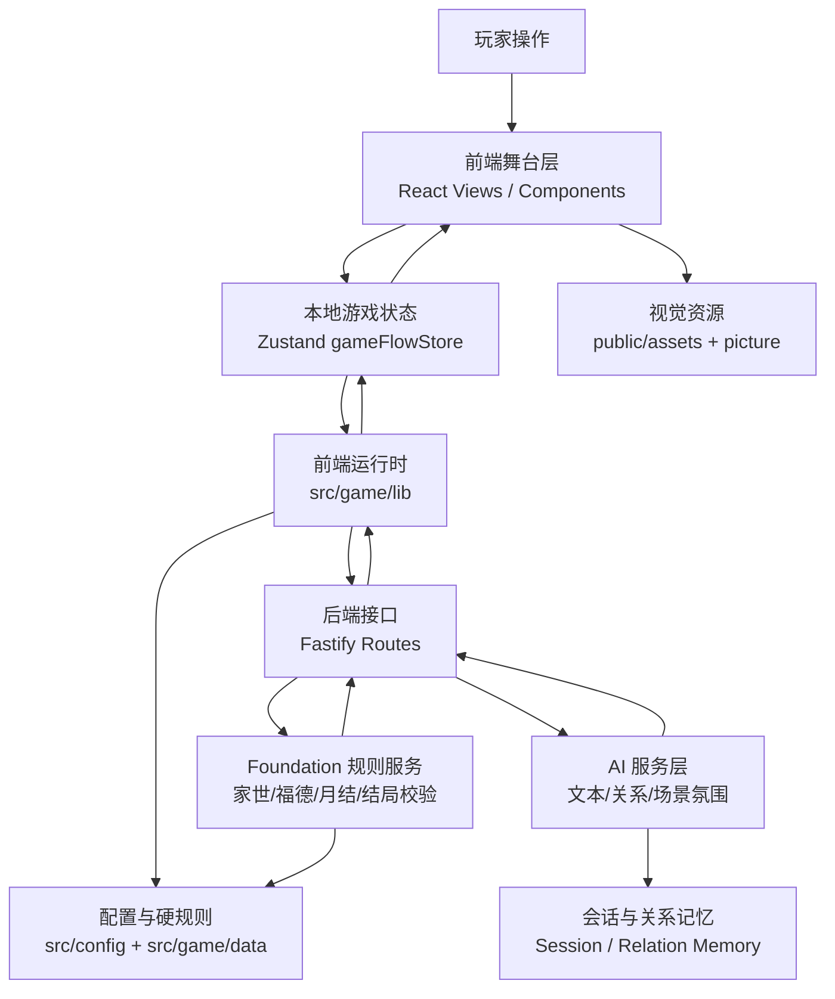

### 2.1 代码分层

| 层级 | 目录 / 文件 | 主要职责 |
|---|---|---|
| 应用入口 | `src/App.tsx` | 根据 `currentView` 切换启动、路线、属性、开场、地图、寝殿 |
| 页面视图 | `src/views/*` | 承载关键流程页面和主玩法界面 |
| UI 组件 | `src/components/*` | 对话框、状态栏、妃嫔列表、寝殿子面板等 |
| 游戏状态 | `src/game/store/gameFlowStore.ts` | 当前存档真值、时间、资源、妃嫔、物品、关系进度、结算报告 |
| 游戏类型 | `src/game/types.ts` | 路线、时间、属性、道具、妃嫔、关系 AI、存档结构类型 |
| 规则配置 | `src/config/*`、`src/game/numerics/*` | 时间、体力、位分、路线、地点开放、颜色、系统事件等硬规则；核心可调数值由 numerics CSV 和 catalog 提供 |
| 剧情配置 | `src/game/narrative/csv/*`、`src/game/narrative/narrativeCatalog.ts`、`src/game/narrative/narrativeDialogueAdapter.ts` | 按系统域维护剧情正文、说话人、立绘键、立绘位置和场景提示；代码引用稳定剧情 ID，并通过 adapter 将完整 entry 转换为对应 UI 展示结构 |
| 随机事件配置 | `src/game/random-events/csv/random_events.csv`、`src/game/random-events/randomEventCatalog.ts`、`src/game/random-events/randomEventRuntime.ts` | 维护可抽取事件池、前置事件、剧情行、选项、局部效果和后续解锁；当前已接入杜娘闲谈，进度保存于 `progress.randomEvents` |
| 前端运行时 | `src/game/lib/*Runtime.ts` | 本地兜底对话、地点交互、关系判定调用、寝殿工具函数、玩家姓名称呼解析 |
| 后端入口 | `server/src/app.ts` | 装配 AI、Foundation、Memory、路由、缓存、错误处理 |
| AI 路由 | `server/src/routes/aiRoutes.ts` | `/api/v1/ai/*` 对话、数值、关系、场景氛围接口 |
| Foundation 路由 | `server/src/routes/foundationRoutes.ts` | `/api/v1/foundation/*` 家世、福德、月结、晋升、结局校验 |
| 规则文档 | `game word/`、`docs/`、`reports/` | 系统硬规则、AI 接口、剧情节点、经济、宫斗、怀孕等策划源文档 |

## 3. 玩家主流程

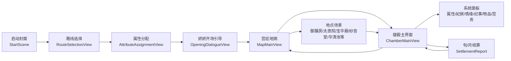

### 3.1 当前页面流与状态字段

| 流程节点 | 视图 | 关键状态 |
|---|---|---|
| 启动 | `StartScene` | `currentView='start'` |
| 选线 | `RouteSelectionView` | `selectedRoute`、`routeId`、路线基础数值 |
| 属性 | `AttributeAssignmentView` | `state.name`、`age`、`family`、`stats`、`pointsLeft` |
| 开场 | `OpeningDialogueView` | `openingTendency`、`openingGuideFinished`、开场 AI/本地兜底 |
| 地图 | `MapMainView` | `activeMapLocation`、`mapEventText`、地点热点；不承载地点内互动 |
| 寝殿 | `ChamberMainView` | `activeChamberPanel`、训练行动、地点子场景、结算报告、地点内 NPC / 特殊入口 |
| 面板 | `components/chamber/*` | 妃嫔、情缘、纪事、库存、宫务、杂项信息 |

场景级视觉容器规范：

- 启动、路线选择、属性分配、开场、地图和寝殿都属于 scene stage，外层 frame 必须填满浏览器 viewport。
- 场景级 frame 不得使用 `width: min(100vw - npx, 1440px)`、固定 16:9 居中卡片、外层 `border-radius`、外层边框或外层投影来形成“套框”。
- 圆角、边框和投影只用于内部面板、弹窗、按钮、状态卡等 UI 组件，不用于裁切整张场景背景。
- 地图地点标志使用全屏场景时，竖排 `map-main__hotspot` 的宽度必须按 16:9 设计舞台封顶，避免超宽 viewport 下按钮跟随整屏宽度横向变胖。
- 新增页面若承载完整场景，应复用当前 viewport stage 规则；只有真正的内部工具面板才允许做卡片化布局。

启动菜单现状：

- `开始` 已接入新局流程：先弹二级确认，确认后清空旧存档，重建初始状态，进入路线选择。
- `回溯` 已接入单槽读档：读取上一次 `SaveGameV1`，并根据存档进度恢复到路线选择、属性页、地图或寝殿。
- `前尘` 目前只存在于 `StartScene` 的按钮文案中，尚未接入成就 / 结局 / 前世记录系统。
- `设置` 目前只存在于按钮文案中，尚未接入设置页。
- 存档维护规则以 `docs/save-system-maintenance.md` 为准；不得再用单纯 `setCurrentView('route-selection')` 代替新局创建。

姓名显示规范：

- `state.name` 是玩家当前姓名真值。
- 属性页修改姓名必须通过 `gameFlowStore.setPlayerName(name)`，同步 `state.name` 与 `selectedRoute.defaultName/baseState.name`。
- 剧情文本需要称呼玩家时，优先使用 `src/game/lib/playerNameRuntime.ts` 生成完整姓名、姓氏或 `某氏`，避免继续写死路线默认名。
- 路线历史背景中的家族案名可以保留固定设定；他人对玩家的直接称呼必须读取当前姓名。

属性加点交互规范：

- 属性加减按钮的 `disabled` 必须反映当前硬规则，而不是只在点击回调里阻止非法操作。
- 当前值等于字段下限时禁用 `减少`；当前值等于字段上限时禁用 `增加`。
- `pointsLeft` 为 0 时禁用所有需要消耗点数的 `增加` 操作，但仍允许对高于下限的属性执行 `减少` 以回收点数。
- 路线锁定属性时，属性加减按钮全部禁用。

剧情 / 对话交互锁规范：

- `GlobalDialogueStage` 是剧情、旁白、地图提示、寝殿反馈和通报的共享遮罩入口。
- 剧情正文和基础演出元数据优先来自 `src/game/narrative/csv/`；运行时代码负责选择剧情 ID、传变量和处理状态，不在 CSV 中写 JS 表达式、数值公式或条件逻辑。需要说话人、立绘、旁白名和正文一起出现的剧情，应按完整 entry 读取，并通过 `narrativeDialogueAdapter` 转换为当前 UI 所需结构，不能只配置 `text`，也不能在各业务流程里重复手写 `entry.speakerName` / `entry.text` 映射。
- CSV 变量统一使用 `{{variableName}}`，正文分页使用现有 `<<PAGE_BREAK>>`；缺失变量在运行时保留原样并由测试捕获，不静默吞掉。
- 随机事件正文暂不并入 `narrativeCatalog`；第一版由 `src/game/random-events/csv/random_events.csv` 单表维护事件元信息、剧情行、选项、局部效果和解锁。随机事件 runtime 只能作为纯函数被未来入口调用，不能直接读写 store、存档或 UI。
- 任意剧情 / 对话文本正在显示时，除当前对话框、分支选项和同场景明确允许的操作区外，背景 UI 不能响应点击。
- 视觉层由 `global-dialogue-stage__interaction-lock` 吃掉背景鼠标事件；业务层由 `ChamberMainView`、`MapMainView` 的交互锁判断兜底，避免键盘、测试或程序化点击绕过遮罩。
- 寝殿行动反馈未收起时，不能继续点学习、外出、家族事务、情缘等按钮；地图剧情反馈未收起时，不能点侧栏或热点。
- “对白 + 场景内固定按钮”的混合场景必须拆出空闲态与对话态：空闲态不渲染 `GlobalDialogueStage`，对话态才挂共享遮罩，并在对白收束前禁用固定按钮。建章宫、侍寝会面、妃嫔会面都应按此规则处理。
- 地点入场对白只属于“从地图进入地点”的一次性演出。玩家留在同一地点内进行行动、结算数值、推进时辰或打开地点内面板时，不得再次触发入场对白；地点内行动结果应使用自身的 `LocationActionResultStage` 或对应地点对话态展示，并作为地点场景层级的全局对白渲染，不能嵌套在地点操作卡片、按钮栏或小面板内部。
- 后续新增剧情浮层时，如果复用 `GlobalDialogueStage`，默认继承交互锁；如果自建浮层，必须显式说明哪些背景操作仍可点。

## 4. 核心玩法循环

### 4.1 单旬循环

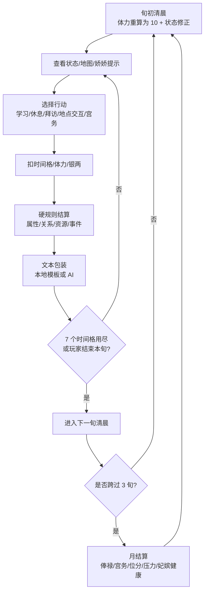

清晨通报与黑屏转场规则：

- 深夜行动、体力归零、结束本旬和玩家侍寝后，必须先进入黑屏转场；黑屏期间只做时间推进、体力重算、外景上下文清理和回到寝殿清晨。
- 所有清晨结算通报，包括普通旬报、月初通报、侍寝后通报、熬夜惩罚和晋升传旨，都必须在黑屏淡出结束后才显示。
- `ChamberMainView` 的黑屏状态只负责 `fade-in -> 推进/复位 -> fade-out -> hidden`；`showSettlementReport` 必须等 `overnightTransitionPhase === 'hidden'` 才能放行。
- 普通睡觉流程统一经 `completeOvernightTransition` 复位到寝殿；玩家侍寝结算虽然由 `finalizePendingNightlyService` 直接生成次旬清晨，也必须同步清理外景位置并回到寝殿主循环。
- 晋升通报是清晨通报队列中的最高优先级演出，但仍不能出现在黑屏中；内侍送旨和圣旨展开都发生在清晨寝殿可见后。圣旨展开阶段使用右侧题签素材、长卷轴柄和由通报时间生成的宫历日期，不参与实际位分判定。圣旨舞台必须同时按视口宽度和高度约束，正文从右侧题签左边固定起排，避免宽屏下裁掉末尾列。

### 4.2 月循环

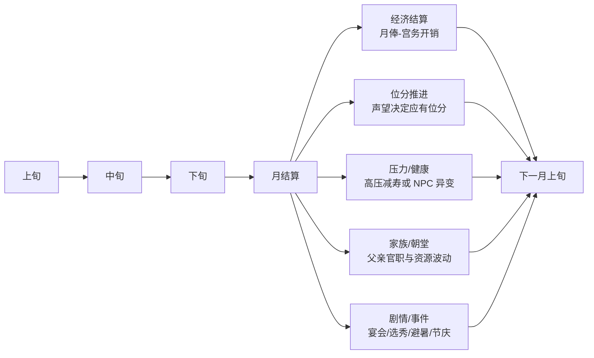

## 5. 系统思维导图

```mermaid
flowchart TB
  Root["后宫养成系统"]

  Root --> Time["时间经营"]
  Time --> TimeA["年月旬"]
  Time --> TimeB["七时间格"]
  Time --> TimeC["旬初体力重算"]
  Time --> TimeD["月结算"]

  Root --> Growth["玩家成长"]
  Growth --> MainStats["主属性"]
  MainStats --> Health["健康"]
  MainStats --> Fortune["福德"]
  MainStats --> Intrigue["心计"]
  MainStats --> Appearance["容貌"]
  MainStats --> Temperament["气质"]
  Growth --> Skills["副属性"]
  Skills --> Poetry["诗词"]
  Skills --> Music["乐理"]
  Skills --> Painting["丹青"]
  Skills --> Embroidery["刺绣"]
  Skills --> Medicine["药理"]
  Skills --> Politics["政治"]
  Growth --> Resources["资源"]
  Resources --> Silver["银两"]
  Resources --> Prestige["声望"]
  Resources --> Favor["宠爱"]
  Resources --> Stress["压力"]
  Resources --> TrueHeart["真心值"]
  Growth --> Works["作品制作"]
  Works --> EmbroideryWorks["绣花作品"]
  Works --> PaintingWorks["字画作品"]
  Works --> IncenseWorks["调香作品"]

  Root --> Harem["后宫生态"]
  Harem --> Consorts["妃嫔名单\n初始存活妃嫔 12 人"]
  Harem --> FavorTier["宠爱档位"]
  Harem --> Relation["关系与倾情"]
  Harem --> Rank["位分与居所"]
  Harem --> ColdPalace["冷宫"]

  Root --> Events["事件系统"]
  Events --> Banquet["宫宴"]
  Events --> FamilyBanquet["家宴"]
  Events --> Selection["选秀"]
  Events --> Summer["避暑"]
  Events --> Strife["宫斗案件"]
  Events --> Pregnancy["侍寝怀孕"]

  Root --> External["外部经营"]
  External --> Family["家族事务"]
  External --> Court["朝堂事务"]
  External --> Heir["皇嗣管理"]
  External --> Trade["杜娘交易"]
  External --> YetingPoison["掖庭月姑姑\n毒药交易"]

  Root --> AILayer["AI 包装"]
  AILayer --> OpeningAI["开场引导"]
  AILayer --> DialogueAI["妃嫔对话"]
  AILayer --> JudgeAI["关系倾向判定"]
  AILayer --> AmbientAI["地点氛围文本"]
  AILayer --> Fallback["本地兜底"]
```

## 6. 数值状态模型

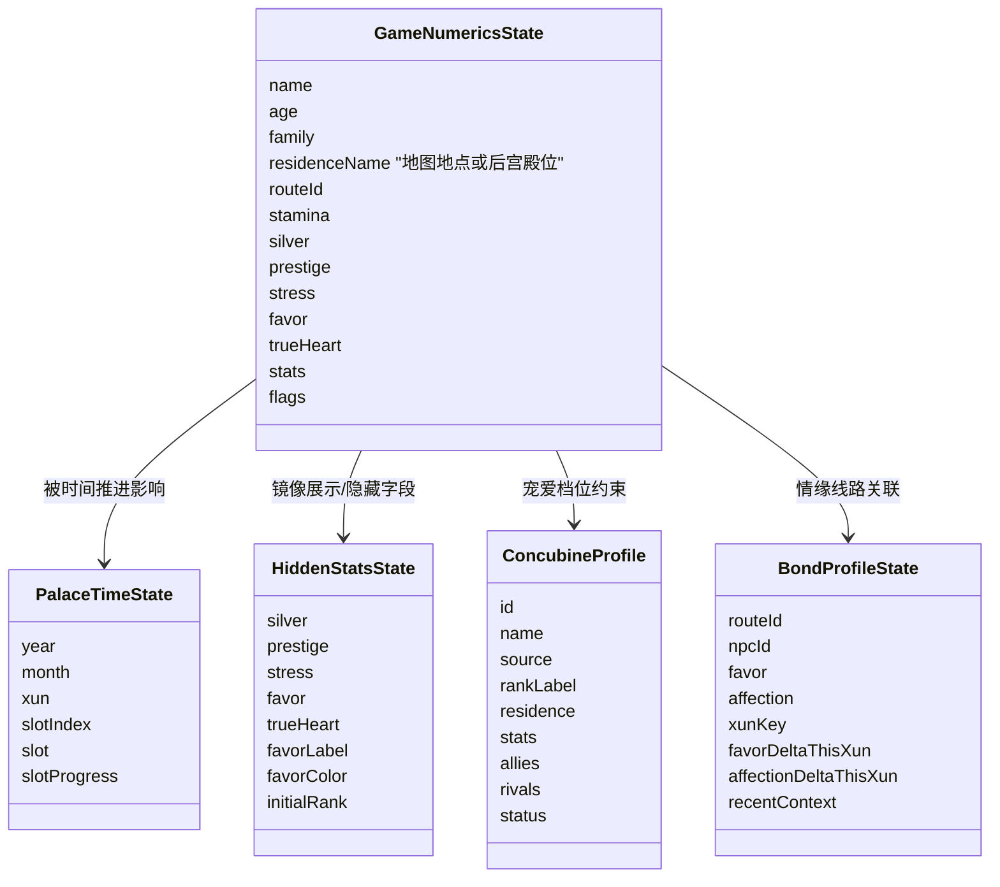

### 6.1 核心数值表

当前核心数值配置入口：

- `src/game/numerics/csv/player_attribute_fields.csv`：玩家属性字段、创建面板范围、默认点数、真值倍率和属性说明。属性创建页与局内个人属性面板的主属性 / 技艺属性 `?` 说明按钮直接读取 `description`；该列是玩家可见文案，只概括说明属性含义和大致影响方向，不写过细的隐藏系统、内部公式或具体判定名。
- `src/game/numerics/csv/player_status_fields.csv`：玩家局内非加点状态说明。局内个人属性面板中的声望、宠爱、野心、家世、压力、子嗣等 `?` 说明按钮直接读取此表；这些字段不参与创建面板加点，因此不放入 `player_attribute_fields.csv`。
- `src/game/numerics/csv/consort_attribute_fields.csv`：嫔妃属性字段和玩家可见说明。嫔妃总览中声望、宠爱、野心、好感、倾情等属性后的 `?` 说明按钮直接读取 `description`；组件只能按属性 key 取配置，不维护第二份解释文本。
- `src/game/numerics/csv/global_numeric_rules.csv`：全局范围、体力、属性倍率、熬夜惩罚、家族接济和新局基础参数。
- `src/game/numerics/csv/route_initial_profiles.csv` / `route_initial_stats.csv` / `family_initial_traits.csv`：路线初始范围、初始位分候选、家世候选、家世词条点数 / 声望修正和固定属性路线。初始可分配点数统一按 `基础点 + 路线修正 + 家世词条修正` 计算，不再随机。
- `src/game/numerics/csv/chamber_actions.csv`、`monthly_expense_strategies.csv`、`rank_prestige_table.csv`、`favor_tiers.csv`：寝殿行动、月用度、位分门槛和宠爱分层。
- `src/game/numerics/csv/inventory_items.csv`、`fixed_consort_roster.csv`：物品池、商店、毒药、曲谱和固定妃嫔种子数值。当前 `initial` 物品池保持为空，玩家开局不带初始背包物品；任务 / 剧情关键物品统一用 `isQuestItem` 标记，不能被杜娘或通用回收收购。
- `src/game/numerics/csv/palace_strife_*`、`yangxin_verdict_choice_rules.csv`：宫斗严重度、流言严重度、裁断处罚倍率和关系影响。主动宫斗检定、嫌疑人动机、初始定案率、银两干预等完整公式维护在 `src/game/numerics/formula-pages/palaceStrifeFormulaPage.ts`，由公式解析器求值。
- `src/game/numerics/csv/nightly_*`：皇帝独寝率、侍寝池宠爱权重、兴致收益档位、第三方美言 / 抹黑与侍寝保底值。侍寝互动选项读取属性与分段加成的完整公式维护在 `src/game/numerics/formula-pages/nightlyServiceFormulaPage.ts`。
- `src/game/numerics/csv/generated_consort_templates.csv`、`generated_consort_rules.csv`：随机补足妃嫔模板、开局目标人数、属性浮动和病中健康阈值。

`numericCatalog` 是这些表的统一读取入口。公式逻辑、随机算法、状态流转和数值落地仍留在 runtime / store 中。

| 类别 | 字段 | 范围 / 口径 | 主要来源 | 主要用途 |
|---|---|---|---|---|
| 时间 | `year/month/xun/slot` | 12 月、3 旬、7 格 | `advanceTime` | 行动消耗、事件触发、结算 |
| 体力 | `stamina` | 0..15，旬初基础 10 | 寝殿行动、休息、饮食、温泉 | 控制行动频率 |
| 银两 | `silver` | 非负 | 月俸、赠银、交易 | 购买、案件干预、朝堂/家族投入 |
| 声望 | `prestige` | -2000..5000 | 宴会、侍寝、妃嫔美言、家族、宫斗结果 | 位分、结局、冷宫风险 |
| 宠爱 | `favor` | -100..100 | 皇帝互动、妃嫔美言/抹黑 | 侍寝权重、月俸修正、宠爱档位 |
| 真心 | `trueHeart` | 路线差异 | 特殊剧情、长期互动 | 夜晚权重、宽判、真爱保护 |
| 压力 | `stress` | 0..100 | 宫斗、杀人、造谣陷害 | 减寿、性情变化、疯癫风险 |
| 福德 | `fortune` | 运行时 -100..100；属性分配阶段 1 点折算 10 福德 | 礼佛、造谣、下毒 | 怀孕、流产、道德风险 |
| 主属性 | 健康/心计/容貌/气质 | 0..1000 | 开局分配、行动、物品 | 生产、宫斗、表现、魅力 |
| 副属性 | 诗词/乐理/丹青/刺绣/药理/政治 | 0..100 | 学习、地点交互 | 乐理、医药、朝堂、剧情门槛 |

属性单位边界：

- 属性分配页允许临时使用加点单位：健康 / 心计 / 容貌 / 气质每 `1` 点折算 `100` 运行时值；福德每 `1` 点折算 `10` 运行时值；副属性每 `1` 点折算 `10` 运行时值。
- 玩家确认进入剧情时，`finalizeAttributeAssignment()` 必须把所有加点单位写成运行时真值，并设置 `flags.attributeStatsFinalized=true`。
- 确认后的正式流程、存档、toast 和 runtime 公式默认读取运行时真值；如果公式需要 0..10 的“能力档”参与计算，应显式从运行时值反推局部公式值，不得修改 `state.stats` 的单位。
- `attributeStatsFinalized=true` 的存档不得恢复到属性分配页；如果开场还没完成，应进入开场对白，避免创建面板把运行时真值再次按加点倍率展示。

### 6.2 数值变化反馈

玩家核心数值变化必须同时满足“硬规则先结算”和“界面即时可见”：

- 数值真值仍由 `gameFlowStore` 的 `state` / `hiddenStats` 与各 runtime 规则结算，不由文案决定
- 声望扣减允许进入负值，玩家与妃嫔侧统一按 `PRESTIGE_RANGE = [-2000, 5000]` 裁剪，不再以 0 为下限
- toast 只负责展示差值，不反向参与规则计算
- toast 观察玩家银两、声望、压力、真心、属性字段与妃嫔声望；体力、宠爱和 NPC-NPC 内部交流造成的妃嫔压力变化由状态栏、面板、关系矩阵或叙事通报承接，不触发 toast
- 属性字段只在属性分配阶段做展示换算；进入剧情后玩家面板、寝殿技能条和 toast 都直接展示运行时真值，不再二次乘倍率
- 单次状态变化中的每个差值必须独立生成 toast，连续变化可叠加多个 toast
- toast 不随数值写入立即显示；数值变化先按事件桶排队，等对应行动对白、地图反馈、夜晚通报或旬月通报实际出现后再释放
- 侍寝、宫斗、月结等来源造成的声望变化必须进入 toast；宠爱变化不进入 toast
- 玩家主动宫斗登记案件时会扣福德；该扣除必须由 `startPalaceStrifeCase` 自身同步触发本次行动的数值反馈，不能依赖道具消耗、后续通报或下一次状态变化顺带释放
- 转场、地图切换、寝殿对白切换不得卸载或吞掉尚未读完的数值反馈
- 寝殿行动与侍寝通报文本不展示具体属性 / 宠爱 / 真心 / 声望加减，只保留叙事反馈；允许展示的具体数值变化由 toast 展示，宠爱和体力除外
- 角色选择、属性分配、开场剧情等初始化阶段只刷新数值基线，不显示 toast；进入地图或寝殿后才开始显示数值变化

## 7. 路线系统

| 路线 | 初始倾向 | 设计功能 |
|---|---|---|
| 兰因絮果 | 高起点宫廷权力线 | 主要承载权力、皇嗣、摄政、独宠、共主等结局 |
| 浮生如梦 | 标准剧情线 | 承载非意外结局与情感叙事 |
| 影落掖庭 | 低资源翻案线 | 以沉冤得雪、证据、家族翻案为主目标 |
| 尘缘夙错 | 异国/故国线 | 承载和亲、改朝换代、阿翎等专属内容 |

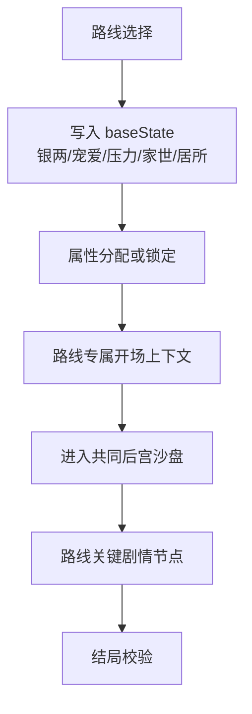

系统宫宴当前已接入第一版纵向闭环：

- 报名开启：跨入目标宫宴前一个月的报名起点时，生成 `event` 类通报，由司乐女官 / 掌册宫人提醒妙音堂开始收录曲谱。首届宫宴在 1 年 3 月上旬，报名起点为 1 年 2 月上旬清晨。
- 学谱：玩家持有曲谱后，可在妙音堂找连翘学习该曲；`musicHallProgress.musicScoreMastery` 按曲谱保存难度、完成度、练习次数与表现上限。学习收益受玩家乐理、曲谱难度和连翘关系影响。
- 报名：玩家在妙音堂登记一张曲谱，系统保存曲谱快照到 `palaceBanquetProgress.submittedScore`，本届不重复改写；登记不消耗库存曲谱，报名后仍可继续练习该曲。
- 结算：每年 3 月上旬傍晚进入系统宫宴，宫宴占用傍晚和夜晚，结算后停在深夜。
- 结果：`palaceBanquetRuntime` 根据已登记曲谱的当前完成度、曲谱难度计算表现上限，再在宫宴当天按上限随机生成本场表现分，最终结算声望变化与事件通报。
- 去重：`lastRegistrationNoticeSeasonKey` 与 `lastResolvedSeasonKey` 防止报名提醒和宫宴结算因读档或连续推进重复触发。

曲谱当前作为“可长期学习的曲目”服务系统宫宴；后续若扩展适性、稀有曲谱来源或妃嫔竞争，应继续以宫宴 runtime 作为唯一硬结算入口。

曲谱练习当前公式：

- 曲谱难度：红谱 `85`，紫谱 `65`，蓝谱 `50`，其他 `40`。
- 乐理值：读取既有玩家属性字段 `state.stats.talent`，该字段在界面和规则中显示为“乐理”。正式游戏中该字段为 `0..100` 运行时真值；学谱公式内部按 `/10` 折算到 `0..10` 能力档。
- 连翘协助值：已结识连翘时为 `clamp(连翘好感 + 连翘情谊, 0, 200)`，未结识时为 `0`。
- 单次学谱完成度增量：`clamp(8 + floor(乐理值 / 2) + floor(连翘协助值 / 25) + 随机浮动 - floor(曲谱难度 / 18), 3, 24)`；随机浮动为 `0..2`，同一存档种子下可复现。
- 学谱成长：每次学谱额外增加运行时真值 `talent +2`，toast 显示“乐理 +2”。
- 表现上限：`clamp(40 + 完成度 * 0.65 + 乐理值 * 4 + floor(连翘协助值 / 8) + floor(曲谱难度 / 4), 20, 220)`。
- 宫宴本场表现分：在 `floor(表现上限 * 0.55)..表现上限` 间按宫宴季和曲谱生成随机分；练谱只提高完成度与表现上限，不直接锁定最终表现分。

路线选择也是新建一局的边界：调用 `applyRouteSelection` 时必须从初始状态重建路线状态，重置时间、临时文本、结算通报、宫斗案件、侍寝进度、交易记录、库存与关系进度，避免旧存档状态串入新局。

启动页“开始”才是清档新建存档的入口；路线选择只负责写入具体路线档案，不负责二级确认。

开发期不维护旧存档迁移。`SaveGameV1` schema 或必需字段与当前代码不一致时，读取阶段直接删除旧 envelope；不要在 `restoreSaveGameV1Fields()` 或 persist `merge` 中写旧字段 fallback。

## 8. 地图与场景系统

### 8.1 场景结构

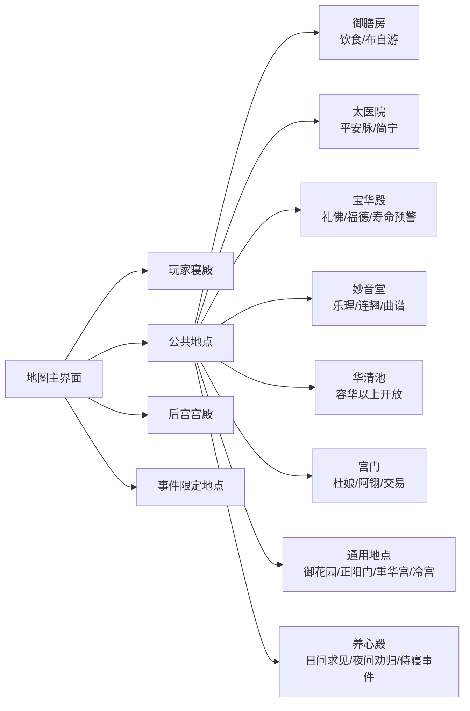

### 8.2 地点开放规则

| 地点类型 | 示例 | 开放口径 |
|---|---|---|
| 全天开放 | 御膳房、太医院、妙音堂、宝华殿、御花园、后宫宫殿 | 任意时间格可进入 |
| 时段开放 | 正阳门、宫门、重华宫、养心殿 | 指定时间段开放；养心殿上午到深夜可进入 |
| 条件开放 | 华清池 | 位分达到容华及以上 |

## 9. 寝殿行动系统

| 行动 | 时间 | 体力 | 叙事反馈 |
|---|---:|---:|---|
| 诵读经典 | 1 格 | -2 | 静心温书，诗词 +1、政治 +1 |
| 泼墨作画 | 1 格 | -3 | 铺纸试墨，丹青 +1，并推进字画作品 |
| 镂月裁云 | 1 格 | -3 | 理线补绣，刺绣 +1，并推进绣花作品 |
| 调制香薰 | 1 格 | -3 | 辨香调方，容貌 +1，并推进调香作品 |
| 习舞奏乐 | 1 格 | -2 | 校音习舞，气质 +1、乐理 +1 |
| 请平安脉 | 1 格 | 0 | 请医问诊，健康 +5，每旬一次 |
| 殿内小憩 | 1 格 | +3 | 闭目养神，压力 -1 |
| 外出探索 | 0 格 | 0 | 切至地图 |
| 结束本旬 | 跳转 | 0 | 进入下一旬清晨，体力重算 |

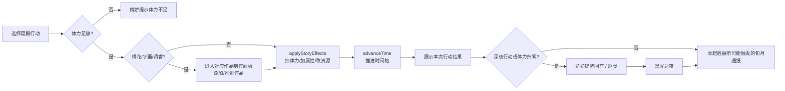

寝殿反馈顺序：

- 普通行动：先结算数值并显示行动结果对白，再进入后续通报或夜晚事件
- 跨旬行动：若行动推进到下一旬，仍先展示本次行动结果，玩家收起后再显示新旬通报
- 外出探索：先显示出行提示，玩家确认后再切到地图，避免提示被转场立即盖掉
- 寝殿面板打开时点击外出：必须先关闭面板并展示出行提示，再切地图，避免对白被面板条件吞掉
- 结束本旬：仍保留原有夜晚/侍寝/清晨通报链路

作品制作规则：

- `泼墨作画`、`镂月裁云`、`调制香薰` 不直接结算行动，而是先进入对应类别制作面板；当前没有独立“作品管理”总入口，避免作品系统和寝殿行动形成两套入口。
- 面板内只有两个即时行动：`练习` 只结算本次寝殿行动的普通加点；`才思泉涌` 结算同样的行动收益，并从当前类别的合格作品池中随机引出一件新作品。
- `才思泉涌` 必须有独立剧情反馈，且正文要写出随机到的作品名；剧情文本维护在 `map_chamber_dialogues.csv` 的 `chamber.craft.inspiration.*` 条目中。
- 进行中作品直接显示在当前类别面板里，点击作品本身会消耗本次寝殿行动并推进该作品进度；完成后作品立刻进入背包，不在制作面板显示已完成库存。
- 作品进度真值保存在 `progress.craftWorks.activeWorks`；题材、主 / 辅能力、灵感抽取门槛、难度、基础售价和基础送礼好感维护在 `craft_works.csv`。
- 单次进度、成色评分、最终售价和送礼好感由 `craftWorkFormulaPage.ts` 的完整公式计算；CSV 不写公式碎片。当前成色阈值为 `粗成 <65`、`工稳 65..89`、`精妙 >=90`。`difficulty` 主要用于制作进度和成色体感，售价只读取归一化后的小幅难度修正，作品价格主要仍来自 `basePrice`。
- 完成品进入背包 `gift` 分类，后续可按普通礼物赠送，也可通过变卖逻辑换银两。调香第一版不接毒药、药效或特殊状态。

归寝与清晨落点：

- 玩家角色不能在普通地图 / 外景中无限停留到次日；普通外出行动若推进到 `深夜`，只表示进入最后一个可行动时段，不立刻跨到清晨。
- 深夜行动完成后，或体力归零后，需要先由贴身宫女提醒回宫 / 睡觉，再进入黑屏过夜转场。
- 睡醒后的落点必须是 `currentView='bedchamber'`、`activeChamberPanel='main'`、`activeMapLocation=undefined`，再展示夜晚侍寝后续或清晨娇娇通报。
- 寝殿主行动和地图普通行动只使用体力作为行动消耗；不要在 UI 或规则反馈中再引入独立“行动值”。
- 华清池深夜双人沐浴等明确以深夜为入口的玩法，仍允许玩家在夜晚行动后落到深夜场景，再使用深夜行动。
- 地点子场景的耗时行动统一通过 `useLocationActionFlow()` 结算；普通行动结果必须用 `LocationActionResultStage` 或等价的 `GlobalDialogueStage` 显示，不能只写静态说明文本。
- 若地点行动触发 NPC 对话，深夜 / 体力归零的睡觉收束要延后到该对话关闭时完成，避免剧情被过夜流程打断。

地图 / 外景入口语义：

- 寝殿主界面的 `外出` 表示前往地图。
- 外景 / 地点场景左侧的 `外出` 表示返回地图主视角；独立 `回宫` 入口才表示直接回寝殿。
- 从地图进入“后宫”时也必须按外景地点处理，保留 `activeMapLocation='后宫'`；后宫内 `外出` 返回地图，`回宫` 直接回寝殿。
- 地图“后宫”热点不得再额外提供“后宫总览”快捷选项；玩家进入后宫统一通过热点默认的 `进入此处`，避免同一个地点同时存在快捷面板入口和外景入口。
- 地图热点卡只负责展示地点名、地点描述和 `进入此处 / 留在地图`；朝堂事务、旧案纪事、宫门交易、公共地点妃嫔偶遇等都必须放到进入后的地点场景中，避免地图弹窗和地点内场景形成双入口。
- 地点子场景统一由 `MapSubsceneView` 呈现：中间画面主区域只放本场景 NPC（固定 NPC、游走妃嫔、皇帝 / 太后等特殊人物），按最多两排、每排三人的透明立牌展示；槽位按底排优先、再向上补位，进入场景后位置不重排。NPC 不得使用卡片底板，必须是“左对齐立绘 / 占位人物 + 横向姓名名牌”的场景摆放形式；宽屏下立牌区域必须随视口自适应放大并尽量撑满中间区域。名牌文本统一为 `官职/位分·名字`，不得在名牌下另起身份行；名牌视觉统一使用深色描边、浅色填色、弱阴影、扁平化风格。右侧只放地点行动和业务入口，按钮组必须垂直居中，底部固定 `离开` 返回地图；NPC 名字不得再作为右侧动作按钮出现。
- 进入地点子场景只负责切换场景和展示可交互对象，不自动播放娇娇入场通传、地点介绍等阻塞对白；强剧情承接应发生在点击 NPC、执行地点行动或触发特殊事件之后。
- 后宫殿位进入妃嫔日常对话同样只属于场景切换：选择殿位、点击殿内妃嫔或会客中的妃嫔不得推进时辰，也不得借 `useLocationActionFlow()` 处理；体力不足仍可阻止拜访，会面内固定操作继续走妃嫔互动次数限制和对应剧情。
- 人物交互页必须复用 `AudienceInteractionShell`：妃嫔日常会面、常驻 NPC（如杜娘 / 阿翎）和后续同类人物入口都应消费同一套 header、状态卡、立绘区、右侧操作栏、picker 面板和对话舞台外壳；不得为单个 NPC 再复制一套“看起来相似”的 portrait/actions/dialogue 布局。人物专属业务只作为 shell 内部的 action 或 picker 内容存在，业务逻辑仍可留在对应地点组件中。该 shell 统一维护左右安全区：左侧状态卡必须避开左侧菱形功能栏，右上返回按钮必须避开时间状态栏，右侧操作栏必须从时间状态栏下方开始排列。
- 空地点或未做专属小玩法的地点统一由 `GenericMapLocationView` 读取 `src/game/data/mapLocationActions.ts` 显示常规行动与地点内特殊入口；行动结果正文继续引用 `location_encounters.csv`，真实行动通过 `useLocationActionFlow()` 推进时辰并接过夜流程。
- 宫门不再由 `MapMainView` 直接打开独立假场景，而是作为 `activeMapLocation='宫门'` 的地点子场景由 `GongmenView` 承载；杜娘 / 阿翎显示在 `MapSubsceneView` 的 NPC 区，交易、闲谈、送礼和售卖保留为工具 NPC 对话后的二级业务。工具 NPC 的右侧操作栏只放交互次数与操作按钮，不得在互动后追加临时提示标识；购买 / 售卖 / 送礼等业务结果由背包、银两和既有数值反馈承担，不塞进右侧按钮组。宫门工具 NPC 人物页不使用共享外壳顶部返回按钮，只保留右侧操作栏中的 `返回`，避免同一页面出现两个退出入口。
- 杜娘是第一名接入常驻 NPC 关系的工具 NPC：初见对白读取 `npc_tools_dialogues.csv`，见过后进入买卖 / 闲谈 / 送礼操作栏；买卖不消耗交互次数，闲谈和送礼消耗每旬次数。杜娘只售卖 `inventory_items.csv` 中 `duniang-always` 池的中低品质宫外物件；她可收购所有 `canRecycle !== false` 且 `isQuestItem !== true` 的物品。杜娘好感达到友情价阈值后，买入价打折、回收价上浮。宫门工具 NPC 的普通入场对白只承担进入人物页的承接作用，不应连续拆成多段阻挡操作；退出人物页统一使用 `返回`，不维护 `返回宫门` 这类地点专属退出文案。
- 杜娘闲谈由随机事件系统驱动：`random_events.csv` 中维护 `npc.du-niang.common`、`npc.du-niang.low-affinity`、`npc.du-niang.high-affinity` 三类事件池，运行时按通用池 + 当前好感池合并抽取。当前杜娘池共 25 个事件，通用池 12 个、低好感池 4 个、高好感池 9 个；内容应围绕她在宫门口听来的日常、宫外街坊、小本买卖、熟人琐事和对宫内生活的好奇展开，避免把所有闲谈写成空泛后宫旁白。正常流程的随机事件正文应优先是对白框可直接显示的台词，不写电视剧剧本式动作 / 环境描写；只有会影响玩家理解的交易或关系信息才可极短补充。杜娘闲谈不能只是空对白：每个事件的剧情行或选项必须至少提供一次 `target.relationToPlayer` 正收益，有选项的事件每个选项也必须有好感收益。玩家发言行的身份栏不得写死为“玩家”，应使用 `{{playerRank}}` 并由运行时传入当前位分；玩家发言行的立绘必须标记 `portraitKey=player`，宫门工具 NPC 页会据此把中间立绘切换为当前路线玩家立绘。随机事件的 `unlockEventIds` 不会立即加入可抽池，而是进入 `progress.randomEvents.pendingUnlocks`，到下一旬清晨才释放。
- 妙音堂、御膳房、太医院、宝华殿、华清池、掖庭院、建章宫等专属地点不得再各自维护一级入口卡片；复杂业务继续保留在二级面板或原有流程中，但入口必须先挂到通用子场景框架。
- 从后宫外景打开左侧工具面板时，关闭面板必须返回 `activeChamberPanel='harem'`；不得退回 `main` 导致后宫 UI 被卸载，也不得借玩家寝殿作为中转。
- 大地图自身的左侧“嫔妃 / 查看 / 纪事 / 情缘”必须作为地图覆盖面板打开，不得先调用 `enterMainChamber()` 借寝殿面板承载；关闭后仍停留在地图。
- 外景回地图时，`enterMapMain()` 只能先切 `currentView='map-main'` 触发退出动画；旧 `activeMapLocation` 和旧面板状态必须保留到 `AnimatePresence.onExitComplete` 后再清理，避免退出动画期间的旧 `ChamberMainView` 短暂重绘成玩家寝宫。

时间通报归属：

- 旬月通报与系统事件通报绑定在时间主循环和 `settlementReports` 队列上，不绑定具体界面。
- 寝殿主界面和地图主界面都必须能展示未读通报；玩家在地图上时，贴身宫女仍会出现并说明时间结算结果。
- 通报显示期间应屏蔽背景 UI 点击，收起后写入 `lastSeenSettlementReportId`。

NPC 旬级动向：

- 每旬由 `npcActivityRuntime` 为 live 且非冷宫妃嫔生成一张行动表，行动包括留宫、公共外出、拜访玩家、拜访其他妃嫔、社交筹谋和敌意筹谋。
- 公共外出地点从 `MAP_HOTSPOTS` 派生，排除“后宫”聚合入口和玩家寝殿占位；御花园、正阳门、重华宫、宫门、建章宫、冷宫、养心殿等空地图点也属于进入后可能出现 NPC 交互入口的地点。
- 妙音堂、御膳房、太医院、宝华殿、华清池等功能小场景优先读取行动表中的安排；没有安排时，不允许再从全体 live 妃嫔里无条件随机抓人。
- 地图热点卡只显示地点自身描述，不显示本旬安排在该地点的妃嫔摘要；真正进入公共地点或空地图点后，NPC 应显示为可点击交互入口，玩家主动点击后再用地点入场叙述和行动摘要进入妃嫔日常对话。
- A 拜访 B 时，B 原本的公共外出被取消并留在自己殿内接待 A；玩家进 B 的殿内时应显示两人同场状态和互动摘要。
- NPC 位置以本旬行动表为真值：公共外出、拜访玩家、未收束的拜访其他妃嫔的行动方不在自己寝宫；未收束的拜访目标留在自己寝宫接待；同一目标每旬最多接待一名 NPC。
- `visit-consort.targetConsortId` 对未收束的目标妃嫔具有位置覆盖优先级；公共地点读取时必须排除正在寝宫会客的目标，后宫读取时必须把她显示为“会客中”。玩家结束殿内会客后，`visit-consort.resolved=true` 表示会客收束，来访者回自己的寝宫，被拜访者取消“会客中”。
- 后宫宫殿匹配应归一 `旧居X` 住址到 `X` 主殿，避免特殊住址和可见宫殿断开。
- NPC 拜访玩家应带有目的，并在寝殿空闲时自动打断流程；NPC 先发起小对话，玩家必须选择接待、试探或拒绝。行动结果、清晨通报和侍寝等高优先级反馈仍先于拜访展示。
- NPC 拜访玩家每旬最多生成一名来访者，且使用低概率生成，避免玩家每天都被妃嫔打断。
- NPC 动向调试只允许输出到浏览器控制台；同一旬进入寝殿或地图后只打印一次 `[npc-activity]` 与表格，不新增玩家可见的调试层。
- 旬末由 `npcRelationRuntime` 根据行动目的结算 NPC-NPC 好感、紧张、压力等变化，并写入 `npcRelationMatrix`。
- NPC-NPC 关系结算造成的压力变化是内部状态变化，默认不向玩家弹 toast；只有明确进入通报、案件或玩家亲眼交互的内容才成为玩家可见反馈。
- NPC 宫斗由每旬全局一次低概率敌意筹谋驱动，每旬最多生成一条 NPC 宫斗案，不再按每个 NPC 单独补掷。

皇帝日间动向：

- 皇帝日间动向由 `emperorActivityRuntime` 按 `routeId + xunKey + entrySlot + location` deterministic 计算，AI 不参与真实结果。
- 地图进入地点时记录临时 `activeMapLocationEntryTime`；地点进入本身不消耗时间和体力，求见、等待下朝、公共偶遇结束后也不额外推进第二格。只有地点内明确行动才推进时间或消耗体力。
- 清晨正阳门可选择“等待下朝”，按概率偶遇皇帝；成功只增加宠爱 `+1`，宠爱变化不触发 toast。
- 养心殿上午到傍晚可求见皇帝，成功率读取玩家宠爱、真心、皇帝心情和时辰修正；上午成功率低但不是固定拒绝。夜晚 / 深夜进入养心殿只触发内侍劝归。
- 中午、下午、傍晚皇帝可能出现在御花园或建章宫；玩家进入对应地点后可点击皇帝入口并进入完整皇帝互动页。
- 皇帝交互页每次只允许一次主行动，另可在送礼 / 美言 / 诉苦中选一次附加话题。送礼消耗真实背包食物、绣品或字画；美言 / 诉苦分别使目标妃嫔声望 `+5 / -5`。
- 主行动包括研墨、按摩、关心、抚琴、闲聊、撒娇、入怀、对弈；`入怀` 要求宠爱高于 `50`。主行动按相关养成属性、宠爱、真心和皇帝心情判定平淡 / 小成 / 大成，影响宠爱、声望或真心。
- 皇帝公共地点偶遇的收束必须按“开场对白 -> 主行动结果 -> 恭送圣驾 -> 退回地图”顺序演出；不得在主行动结果未播放时直接黑屏或离开。养心殿求见成功后的告退文本可使用殿内内侍提醒，公共偶遇必须使用外景随驾催请口径。

全局过夜：

- 深夜行动结束或体力归零后，应由统一过夜请求进入娇娇提醒、黑屏转场、清晨通报链路，不允许某个界面直接从深夜推进到清晨并继续显示原场景。
- 深夜到清晨的普通过夜会应用熬夜惩罚：压力 +2，健康 -0.1，气质 -0.1；该惩罚不得在黑屏前静默扣除，必须在清晨通报生成时由娇娇说明并同步落值，界面副作用由数值系统显示为健康 / 气质约 -10。

toast 反馈口径：

- 数值 toast 由状态差异队列驱动，体力和宠爱不显示 toast。
- 声望、玩家压力、银两、玩家副属性、妃嫔声望，以及物品获得 / 失去应显示 toast；妃嫔压力不作为普通 toast 追踪项。
- 道具新增按 0 -> 当前数量计算正向变化；道具消耗到 0 也必须显示负向变化。
- 开发期调试银两和声望只能使用浏览器控制台 `palaceDebug.addSilver(数量)` / `palaceDebug.addPrestige(数量)`；实现必须通过 store 动作修改对应数值、同步隐藏状态并触发数值反馈，不得把 debug 指令混入正式经济或声望入口。

## 10. 后宫关系系统

### 10.1 关系对象分类

| 对象类型 | 示例 | 系统作用 |
|---|---|---|
| 皇帝 | 容安 | 宠爱、真心、侍寝、册封、养心殿裁断、结局 |
| 固定剧情妃 | 姚玲儿、柳仪芳、江晚晚、沈妙清、陈婉宁等 | 竞争、结盟、剧情节点、案件目标 |
| 可攻略 NPC | 当一、简宁、卢安平、布自游、连翘、阿翎 | 情缘线、地点互动、特殊资源 |
| 工具 NPC | 娇娇、杜娘等 | 引导、通报、交易、系统入口 |
| 自定义剧情妃 | 玩家提交生成 | 丰富后宫生态，必须经硬规则校验 |

### 10.2 关系变动规则

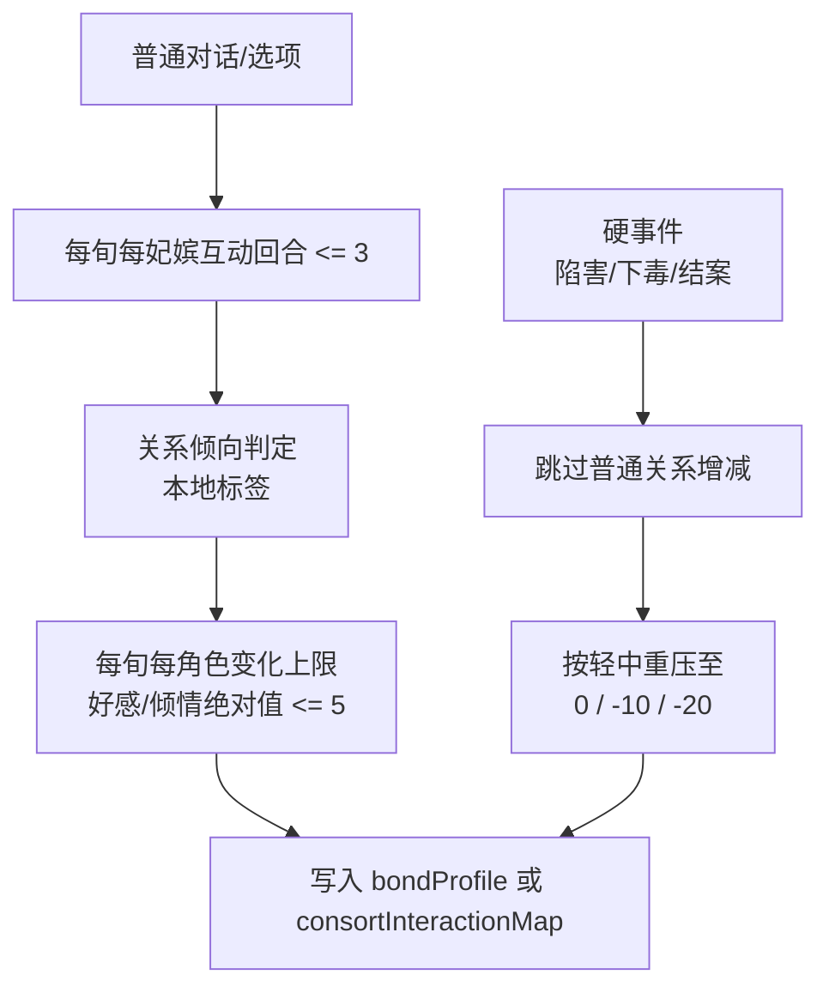

- 玩家与同一妃嫔的主动会面、公共地点关系判定共享 `consortInteractionMap.actionCountThisXun`，每旬最多 `3` 次；次数耗尽后 UI 按不可交互处理，运行时也不再应用普通关系变化。
- 妃嫔会面中同一话题最多继续 `2` 句，防止玩家停留在一次会面中无限翻对白刷信息。最后一次互动必须先完整播放本次行动结果，再进入收束对白；殿内会面使用“宫人送客 / 下旬再叙”，公共地点偶遇使用“随侍提醒行程 / 今日偶遇到此为止 / 让开宫道”。同旬再次拜访只能显示宫人婉拒，不扣体力和时间。
- 妃嫔入场对白或行动结果对白未收起时，场景内固定操作必须禁用；玩家必须先结束当前对白，再选择下一项互动。强剧情流程不得允许入场、结果、送客三种文本同时竞争点击。
- NPC 拜访玩家是行动表事件，每条 `visit-player` 通过 `triggeredVisitIds` 保证只触发一次；这和玩家主动刷妃嫔互动的次数限制是两套入口。

### 10.3 宠爱档位

| 档位 | 范围 | 系统意义 |
|---|---:|---|
| 憎恶 | -100 ~ -50 | 负面关系，高风险 |
| 厌恶 | -49 ~ 0 | 无宠或厌弃 |
| 无宠 | 1 ~ 20 | 低存在感 |
| 小宠 | 21 ~ 40 | 轻度宠爱 |
| 得宠 | 41 ~ 60 | 可参与较多竞争，最多 4 人 |
| 盛宠 | 61 ~ 80 | 高权重，最多 2 人 |
| 独宠 | 81 ~ 100 | 最高档，最多 1 人 |

## 11. 宫斗与案件系统

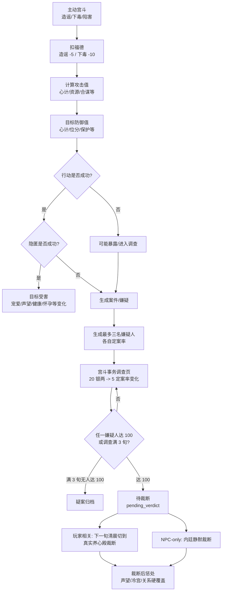

| 子系统 | 关键规则 |
|---|---|
| 主动宫斗 | 造谣、下毒等会消耗福德并增加压力；对象从当前存活且非冷宫妃嫔 roster 动态完整读取，不得按旧 UI 容量固定截断前 6 人 |
| 两次检定 | 先判行动是否成功，再判是否被发现 |
| 合谋/嫁祸 | 可引入第三方，提高复杂度和案件对象 |
| 嫌疑人 | 暴露案件默认生成最多 3 名嫌疑人，实际发起者、被嫁祸者、牵连玩家优先纳入；被嫁祸者初始定案率默认至少 70。动机和初始嫌疑是完整公式，维护在 `palaceStrifeFormulas.ts` |
| 调查推进 | 每旬所有嫌疑人按轻/中/重默认 `+8/+14/+20` 增长，被嫁祸者默认额外 `+5`；默认三旬无人到 100 则疑案归档。严重度表由 `palace_strife_severity_rules.csv` 维护，完整计算不拆成 CSV 公式碎片 |
| 案件干预 | 入口在“宫斗事务”调查页；玩家默认可对调查中任一嫌疑人花 20 银两执行定案率 -5 或 +5；推到 100 进入待裁断，不直接定罪。银两干预折算公式维护在 `palaceStrifeFormulas.ts` |
| 养心殿裁断 | 玩家相关待裁断案在下一旬清晨优先由内侍传旨，切到真实 `养心殿` 场景，使用对话舞台发言与求情；裁断后仍停留在养心殿，旧工具面板不再作为主动入口 |
| 结案影响 | 裁断完成后才写入定罪者和惩罚；若确认陷害/下毒，关系走硬覆盖，不走普通好感增减 |
| 冷宫联动 | 事件导致声望小于 0 可立即进入冷宫 |

## 12. 侍寝、怀孕与皇嗣系统

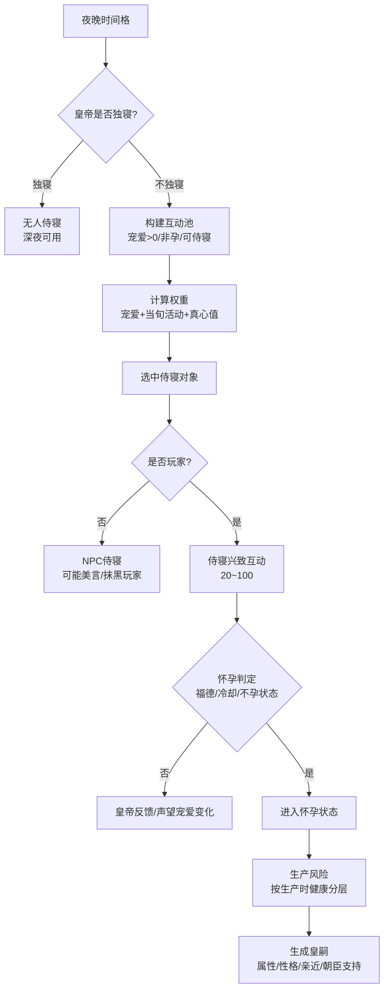

### 12.1 关键规则拆解

| 模块 | 规则要点 |
|---|---|
| 夜晚选中 | 不是每个妃子独立百分比，而是互动池权重抽取 |
| 皇帝心情 | 影响独寝、册封、养心殿裁断 |
| 真心值 | 影响夜晚权重、养心殿带回、求情宽判、处罚保底 |
| 侍寝兴致 | 初始兴致与宠爱档位/历史表现有关，满 100 默认可额外声望；兴致区间收益由 `nightly_interest_effects.csv` 维护，互动选项加成公式维护在 `nightlyServiceFormulas.ts` |
| 怀孕前提 | 生产/流产后 3 个月生育冷却期内不能怀孕 |
| 怀孕概率 | 与福德等硬规则相关，永久不孕为独立隐藏状态 |
| 生产风险 | 按生产时健康值分层结算 |
| 皇嗣管理 | 出生后进入养育、教育、立储、朝臣支持系统 |

## 13. 位分、冷宫与协理六宫

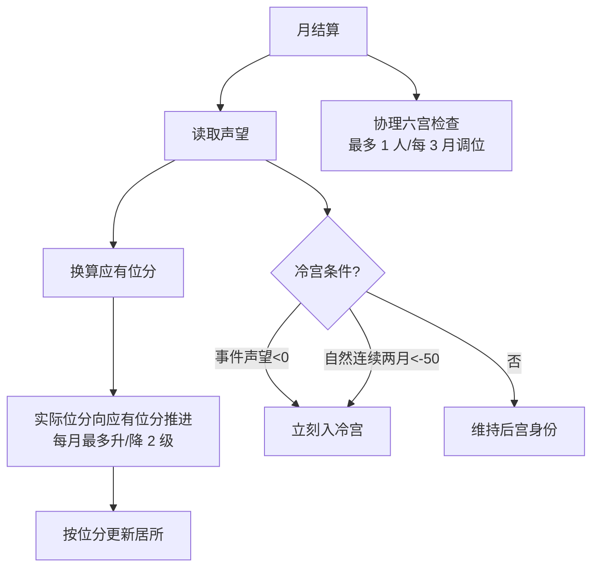

| 机制 | 设计意义 |
|---|---|
| 声望定应有位分 | 避免“未侍寝不能晋升”的旧限制，所有经营都能转化身份 |
| 每月最多 2 级 | 控制身份变动节奏，避免数值爆发 |
| 皇贵妃条件 | 无皇后、皇后健康/宠爱长期失衡等打开特殊高位 |
| 冷宫双路径 | 事件惩处即时冷宫，自然低声望连续触发冷宫 |
| 真爱保护 | 当前皇帝真心值最高者受罚后声望保底 |
| 协理六宫 | 高位权力玩法，可对低位妃嫔调位并由娇娇通报 |

## 14. 经济与物品系统

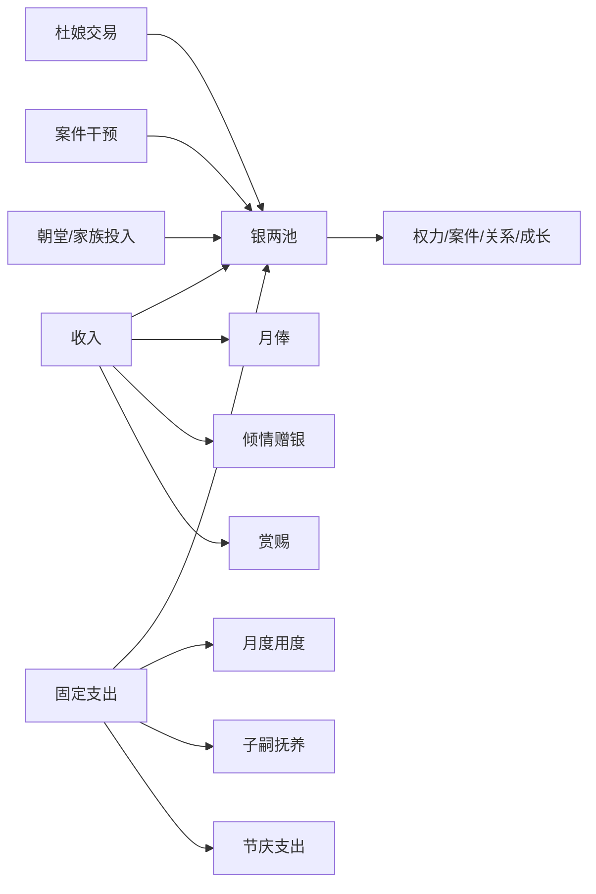

| 系统 | 规则摘要 |
|---|---|
| 月俸 | 按位分基础值，低宠可克扣，高宠可补贴 |
| 月度用度 | 节衣缩食/量入为出/锦衣玉食三档，按实际月俸 25%/50%/75% 结算，并影响声望与健康 |
| 物品品质 | 绿色、蓝色、紫色、红色四档 |
| 补品 | 可送礼或自用，提供健康与容貌 |
| 稀有丹药 | 杜娘池：冷香丸、驻颜丹、延寿丹、缠梦香等 |
| 赏赐池 | 皇帝/太后赏赐池与杜娘稀有池隔离 |
| 大额事件 | 后期 2000/4000/6000 档朝堂事件，提高夺位成功率 |

## 15. AI 与硬规则边界

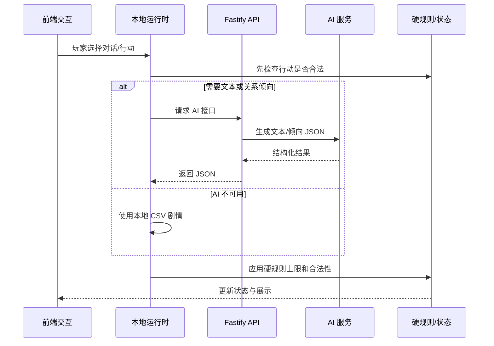

### 15.1 AI 接口分工

| 接口 | 路径 | 职责 | 硬边界 |
|---|---|---|---|
| 健康检查 | `/api/v1/ai/health` | API 可用性 | 不影响玩法 |
| 数值 AI | `/api/v1/ai/calc` | 结构化数值建议 | 需系统校验，不直接写真值 |
| 开场对话 | `/api/v1/ai/opening-dialogue` | 娇娇引导文本与选项包装 | 本地模板可完整兜底 |
| 妃嫔对话 | `/api/v1/ai/consort-dialogue` | 妃嫔对话文本、候选记忆 | 不突破关系变化上限 |
| 关系判定 | `/api/v1/ai/relationship-judge` | 将选项判为 friendly/flirt/cold 等 | 每旬每角色好感/倾情变化绝对值 <= 5 |
| 地点氛围 | `/api/v1/ai/taiyi-ambient`、`temple-ambient`、`miaoyin-ambient` | 场景文案 | 不决定真实收益 |
| 剧情结果 | `/api/v1/ai/narrative/:traceId` | 异步剧情包装 | 结果未就绪返回可重试错误 |

### 15.2 设计原则

| 原则 | 说明 |
|---|---|
| 硬规则先算 | 能不能做、成功率、数值变化、是否建案、晋升、怀孕都由系统决定 |
| AI 后包装 | AI 只负责对白、描述、选项语气、阶段文风、总结 |
| JSON 驱动 | AI 返回结构化 JSON，前端不拼接自由文本作为真值 |
| 可关闭 AI | 关闭 AI 后仍能用模板文本、固定选项、本地关系标签跑完整流程 |
| 关系上限 | 普通对话每旬每角色变化受硬上限约束 |

## 16. Foundation 规则服务

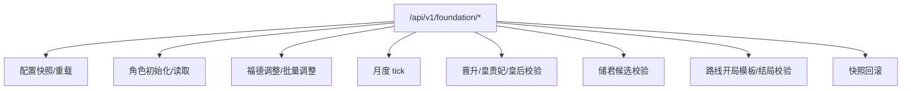

| 能力 | 作用 |
|---|---|
| 配置快照 | 给 GM 或调试工具查看当前规则配置 |
| 角色初始化 | 根据路线、家世生成基础状态 |
| 福德调整 | 支持单人或批量操作，便于宫斗/礼佛接入 |
| 月度 tick | 处理路线压力、寿命、月结类规则 |
| 晋升校验 | 判断皇贵妃、皇后、声望推进等硬条件 |
| 储君校验 | 处理血脉、路线限制、候选资格 |
| 结局校验 | 兰因絮果等路线结局条件表 |
| 回滚 | 为 GM 和异常规则测试提供恢复能力 |

## 17. 系统依赖矩阵

| 系统 | 依赖 | 产出 | 影响 |
|---|---|---|---|
| 时间系统 | 玩家行动、事件强制跳转 | 当前时辰、旬/月结算 | 所有周期性系统 |
| 体力系统 | 时间、状态修正、物品 | 行动可执行性 | 学习、拜访、探索节奏 |
| 属性成长 | 行动、物品、剧情 | 主/副属性变化 | 宫斗、侍寝、生产、剧情门槛 |
| 宠爱/真心 | 皇帝互动、妃嫔行为、剧情 | 宠爱档位、夜晚权重 | 侍寝、月俸、宽判、结局 |
| 声望/位分 | 宴会、侍寝、家族、案件 | 位分、居所、冷宫风险 | 地图权限、身份权力、结局 |
| 宫斗案件 | 心计、福德、银两、关系 | 嫌疑、案件、惩处 | 关系、声望、冷宫、压力 |
| 怀孕皇嗣 | 侍寝、福德、健康、冷却 | 孕期、子嗣、立储候选 | 权力线、经济压力、结局 |
| 经济 | 月俸、宫务、交易、案件 | 银两增减、物品 | 干预案件、朝堂投入、成长 |
| AI 对话 | 状态上下文、记忆、接口 | 文本、语气标签、候选记忆 | 沉浸感、关系体验 |

## 18. 当前落地状态评估

| 模块 | 状态 | 说明 |
|---|---|---|
| 启动/路线/属性 | 已落地 | 主流程可进入地图与寝殿 |
| 时间/体力 | 部分落地 | `advanceTime` 支持时间格、旬/月推进、旬初体力重算 |
| 寝殿行动 | 已落地基础版 | 学习、休息、外出、结束本旬已接入 |
| 地图系统 | 部分落地 | 热点、宫门 NPC、部分地点子场景已接入 |
| 妃嫔系统 | 部分落地 | 初始名单、规范化、宠爱档位上限、面板展示；已接入旬级 NPC 行动表、NPC-NPC 关系矩阵、公共地点动向和拜访同场 |
| 情缘系统 | 部分落地 | bondProfile、关系判定、每旬增减上限 |
| 物品/杜娘 | 部分落地 | 购买、出售、库存、回收价、稀有池雏形 |
| 系统宫宴 | 部分落地 | 报名提醒、妙音堂曲谱提交、3 月上旬自动结算和宫宴结果存档已接入；玩家自主宴席仍是占位 |
| 宫斗案件 | 部分落地 | 玩家主动宫斗已登记案件；NPC 宫斗改为旬级敌意筹谋低频生成，朝堂事务仍为预留入口 |
| 侍寝怀孕 | 规则充分，玩法待完整接入 | 侍寝、怀孕、生产、皇嗣文档详尽，代码侧仍在接口/规则准备阶段 |
| 位分冷宫 | 部分落地 | 月结位分推进和居所更新已在 store 中出现，完整冷宫规则仍需接入主循环 |
| AI 系统 | 接口骨架保留 | 当前玩法断开 AI 正文入口；开场、妃嫔对话、关系判定、地点氛围先走本地 CSV / 本地标签 |
| Foundation | 已有后端服务 | 更像规则沙盒/GM 接口，尚未完全并入前端主循环 |

## 19. 策划视角的主风险

| 风险 | 表现 | 建议 |
|---|---|---|
| 状态模型双轨 | `docs/game-state-model.md` 的 SaveGameV1 比当前 `gameFlowStore` 更完整 | 后续应明确当前 store 是原型存档，还是逐步迁移到 SaveGameV1 |
| 规则已很大，玩法入口未全接 | 宫斗、怀孕、皇嗣、朝堂规则充足，但前端多为预留入口 | 先做纵向闭环，不要继续横向扩写规则 |
| AI 与硬规则边界易漂移 | AI 服务多，若直接返回结果可能影响真值 | 所有 AI 响应必须经过本地/后端 schema 与规则钳制 |
| 月度压力尚未完整释放 | 前 1~3 月可能偏顺，文档也标注待平衡 | 先接入宫务、宴会、家族、案件最小压力，再调数值 |
| 中文字段与技术字段混用 | 配置中存在中文枚举和英文状态键并行 | 保留展示中文，存档真值建议统一英文 key |

## 20. 推荐后续开发顺序

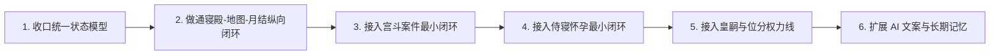

| 优先级 | 任务 | 目标 |
|---|---|---|
| P0 | 统一主存档结构 | 避免后续玩法接入时状态迁移成本失控 |
| P0 | 完成月结算压力闭环 | 让体力、银两、声望、位分真正形成经营压力 |
| P1 | 宫斗案件 MVP | 做通“发起 -> 检定 -> 嫌疑 -> 干预 -> 结案” |
| P1 | 侍寝怀孕 MVP | 做通“夜晚池 -> 侍寝 -> 兴致 -> 怀孕/未孕” |
| P2 | 皇嗣早期养成 | 先接出生后 0~3 岁经济和亲近，再做教育/立储 |
| P2 | AI 记忆正式化 | 将候选记忆晋升为长期关系记忆，但不改硬数值 |

## 21. 一句话系统总结

这是一个以“旬行动 + 月结算”为骨架，以“声望/宠爱/福德/压力/银两”为核心资源，以“后宫关系、宫斗案件、侍寝怀孕、位分权力”为长期驱动的宫廷生存养成游戏；AI 应作为叙事和语气层增强沉浸感，不能替代硬规则成为数值裁判。
